```{r setup, include=FALSE}
knitr::opts_chunk$set(warning = F, results = "markdown", message = F)
```

# **Introduction**

::: {style="text-align: justify;"}
In the fast-paced and competitive world of mobile applications,
understanding what makes an application successful is a pressing
challenge for developers, businesses, and researchers alike. With
Android dominating the mobile operating system landscape—powering over
2.5 billion active devices globally (Brandom, 2019)—the Google Play
Store has become the central hub for app distribution and user
engagement. Offering millions of applications across diverse categories,
the platform serves as an invaluable resource for analyzing user
behavior and preferences.

The key to an app's success lies in understanding the intricate
relationships between various features, such as app category, ratings,
reviews, content suitability, and technical compatibility. Identifying
patterns within these factors enables developers to design apps that
align with user expectations, thereby increasing downloads, engagement,
and retention rates. In this project, we leverage the comprehensive
dataset from the Google Play Store to predict app success based on these
features.

To address this problem, we have adopted a robust machine learning
approach, employing and comparing multiple classification models,
including Logistic Regression, k-Nearest Neighbors (kNN), Random Forest,
Support Vector Machines (SVM), and Extreme Gradient Boosting (XGBoost).
By systematically evaluating the performance of these models, we aim to
determine the most effective classifier for predicting app success.

This analysis not only provides actionable insights for app developers
and stakeholders but also contributes to the broader understanding of
user dynamics and preferences in the app ecosystem. Through this
research, we aim to bridge the gap between user expectations and app
design, empowering developers to make data-driven decisions that enhance
user satisfaction and engagement.
:::

# **Exploratory Data Analysis (EDA)**

### Dataset Overview

::: {style="text-align: justify;"}
The dataset used in this study is a popular collection of Google Play
Store apps, sourced from Kaggle (faisaljanjua0555, 2023). It contains
detailed information about 10,841 apps, organized across 13 variables,
with each row representing an individual app. The dataset covers a range
of app attributes, such as ratings, reviews, size, category, installs,
price, and content rating, providing valuable insights into the
characteristics that contribute to app popularity and user engagement.
This comprehensive data serves as a foundation for analyzing patterns in
user behavior, app performance, and trends within the mobile app
ecosystem.
:::

### Data Cleaning

::: {style="text-align: justify;"}
The Google Play Store dataset, as analyzed, contains missing values and
inconsistent formats across various columns. To clean and prepare this
dataset for analysis, several steps were taken to address these data
quality issues. Here is an overview of how missing records were managed
and further improvements that could be considered:

-   Duplicates: Removed 1,181 duplicate apps, reducing the dataset from
    10,841 to 9,660 unique apps to eliminate redundancy.
-   Price: Cleaned dollar symbols for numeric conversion and removed
    rows with missing or blank prices.
-   Type: Replaced one missing value with "Free" based on a logical
    inference.
-   Size: Standardized sizes (KB/MB) and replaced "Varies with device"
    entries with mean sizes by category.
-   Installs: Removed symbols (+, commas) and cleaned non-numeric
    entries for numeric conversion.
-   Rating & Reviews: Imputed 1,463 missing ratings with category-wise
    means; converted reviews to integer format.
-   Last Updated: Standardized date format for accuracy.
-   Category & Genres: Retained Category while removing redundant Genres
    for clarity.
-   Current Version: Excluded due to inconsistencies across records.
-   Android Version: Removed two rows with 'NaN' values.

Additional Transformations:

-   Review & Install Categories: Binned data for balanced representation
    across reviews and installs.
-   Log Transformed Installs: Applied log transformation to normalize
    install data and reduce skewness.
-   Update Category: Classified updates as "Old" or "Recent" to analyze
    the impact on performance metrics.
:::

# **Data Visualizations**

::: {style="text-align: justify;"}
<<<<<<< HEAD
**Figure 1**. Installs vs reviews
[description]

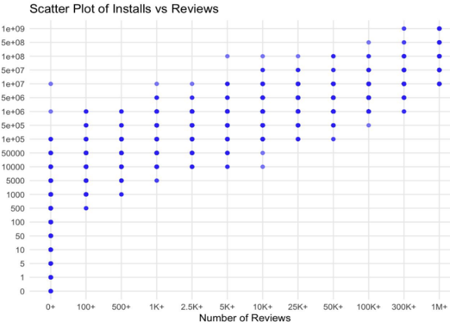{style="display: block; margin: 0 auto;"}


**Figure 1**. Installs vs ratings
[description]

{style="display: block; margin: 0 auto;"}


**Figure 1**. Installs vs Price

[description]
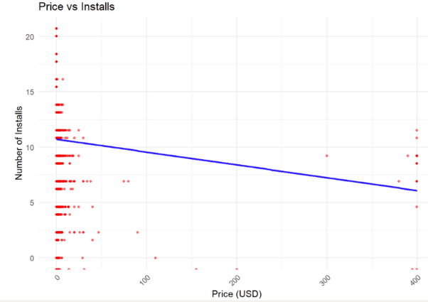{style="display: block; margin: 0 auto;"}


**Figure 1**. Installs vs Category
[description]

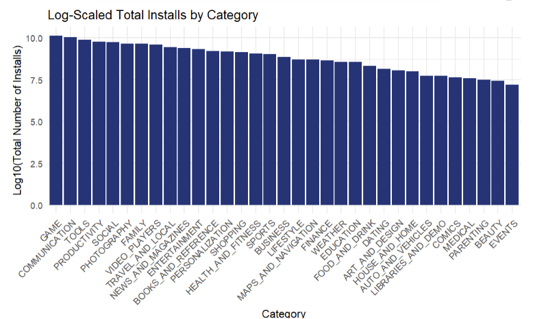{style="display: block; margin: 0 auto;"}

# **Data Pre-processing**

::: {style="text-align: justify;"}
- *Category Encoding*<br>
The Category column was transformed into dummy variables using model.matrix(), and the original column was removed. Column names were standardized by replacing spaces with underscores.
- *Installs Classification*<br>
The Installs column was converted into a binary variable (Low Installs as 0 and High Installs as 1) based on the median value. A histogram was created to visualize the distribution of categories.
- *Last Updated Transformation*<br>
The Last.Updated column was converted into numeric values representing the days since the most recent update, ensuring a quantitative measure of recency.


-\>why choose installs as target variable????????
=======
Key Insights: Highlight patterns, distributions, correlations, or
anomalies in the dataset (e.g., visualizations like histograms, scatter
plots, or correlation matrices).
>>>>>>> 50990e45b0a6525beadbcf0c1f717275661a6ae2

:::

# **SMART Question**

::: {style="text-align: justify;"}
Which are the top 5 app categories, as identified by classification
models (logistic regression, SVM, XGBoost, KNN, and random forest), that
significantly influenced app success (measured by installs) based on app
data from 2010 to 2018, and how accurately can these models predict
success trends within this time period?
:::

::: {style="text-align: center;"}
**Figure 1**. Installs vs Category
:::

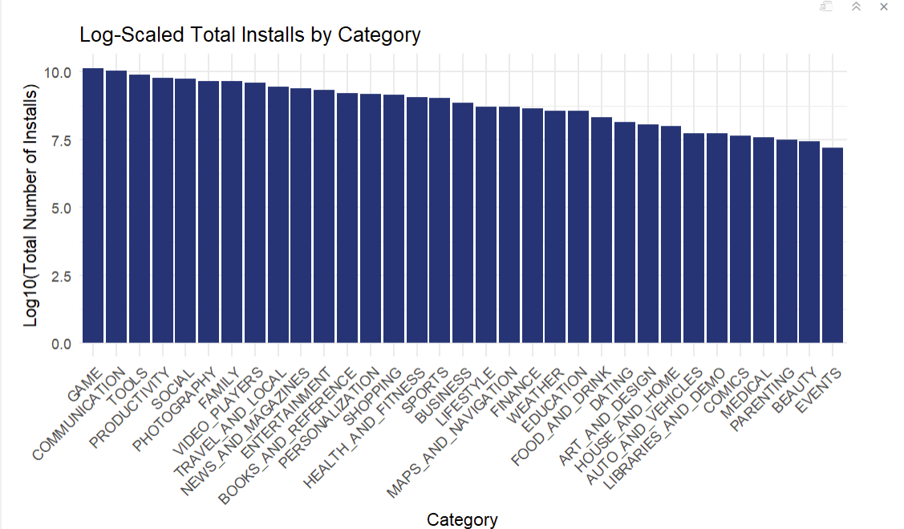

From Figure 1, it could be observed that the top 5 categories having highest Installs are Game, Communication, Tools, Productivity, Social.

::: {style="text-align: center;"}
**Figure 2**. Installs vs Reviews
:::

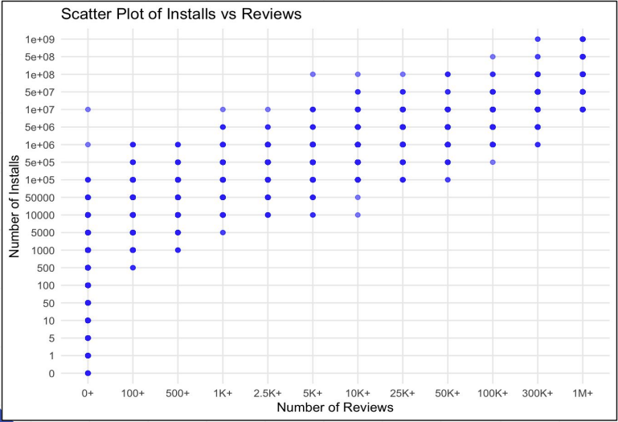

From Figure 2, It is evident that for higher Reviews the installs range is higher, indicating higher Installs for higher Reviews.

::: {style="text-align: center;"}
**Figure 3**. Installs vs Rating
:::


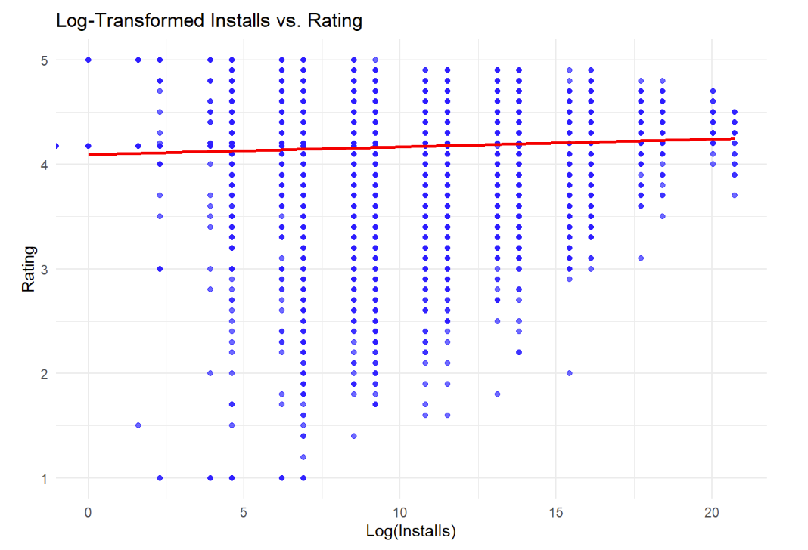
From Figure 3, It could be seen that for high installs the ratings are clustered in the higher range

::: {style="text-align: center;"}
**Figure 4**. Installs vs Price
:::

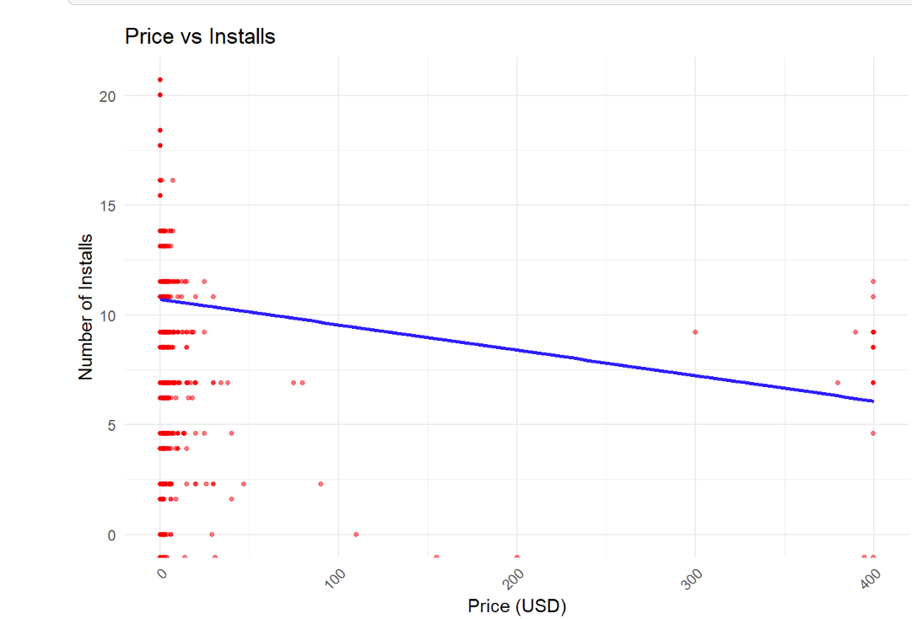

From Figure 4, The installs are higher for apps which are free and decrease in installs as the price increases, indicating better to have a free app for high installs.

# **Model Selection Process**

## Logistic Regression

Logistic Regression model is considered because it is an interpretable
model that is commonly used for classification such as in this project,
the target varibale is binary (Low or High Installs). It estimates the
probability of an outcome, providing clear insights into the
relationship between predictors and the target variable through
interpretable coefficients. In addition, logistic regression performs
well with proper preprocessing and can handle multicollinearity and
feature selection effectively using regularization techniques. While it
may not be ideal for capturing complex, non-linear relationships,
logistic regression can be a strong baseline for this problem.

The initial logistic model includes all 39 variables and has the AIC
value of 2881.6. The stepwise selection is proceeded based on this
logistic model. The result shows that the stepwise model has AIC value
of 2850, indicating that this model performs better than the initial
model. The stepwise model includes 16 out of 39 variables: `Rating`,
`Reviews`, `Price`, `Content.Rating`, `Last.Updated`, `catBUSINESS`,
`catEDUCATION`, `catEVENTS`, `catFINANCE`, `catHOUSE_AND_HOME`,
`catMAPS_AND_NAVIGATION`, `catMEDICAL`, `catNEWS_AND_MAGAZINES` ,
`catPHOTOGRAPHY`, `catSPORTS`, `catVIDEO_PLAYERS`, `catPERSONALIZATION`,
`catBEAUTY`, `catPARENTING.`

In Figure 5., from this stepwise model, the top five importance features
from this model is: `Review`, `Price`, `Rating`, `Last.Updated`, and
`Content.Rating`. The top 5 categories that have most impacted in this
model is `FINANCE`, `PHOTOGRAPHY`, `EDUCATION`, `MEDICAL` and
`HOUSE_AND_HOME`.

::: {style="text-align: center;"}
**Figure 5**. Top 10 Important Features
:::

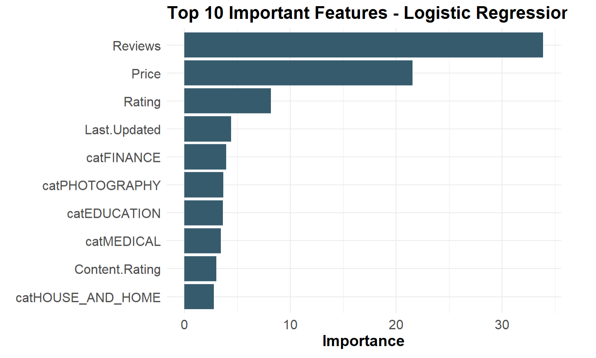{style="display: block; margin: 0 auto;"}

## K-Nearest Neighbour
-\> Why? -\> Advs -\> Explain Parameter

```         
Selection
```

## Random Forest Classifier

The Random Forest classifier is considered because it is a robust and flexible model that performs well in classification tasks, such as in this project, where the target variable is binary (Low or High Installs). It combines multiple decision trees to produce a more accurate and stable prediction through an ensemble approach. Random Forest handles non-linear relationships effectively and is resistant to overfitting due to its random sampling and feature selection techniques. Additionally, it provides insights into feature importance, which can guide further analysis and feature selection.
         
Learning algorithm that constructs multiple decision trees during
training and combines their predictions to improve accuracy and
prevent overfitting. Each tree is trained on a random subset of the
data, and features are randomly sampled at each split, which reduces
correlation between trees and increases generalization. For
classification problems like ours, Random Forest predicts the class
by aggregating votes from all trees and selecting the majority vote.


The initial Random Forest model is built using all 39 variables, and its performance metrics, such as accuracy and F1-score, demonstrate its capability to classify effectively. Feature importance analysis highlights the top predictors contributing to the model's performance. These include Reviews, Price, Rating, Last.Updated, Size, cat_MEDICAL, cat_EVENTS, cat_ENTERTAINMENT, cat_EDUCATION, cat_BUSINESS, and cat_GAME.

The model benefits from hyperparameter tuning to optimize its performance, ensuring that it balances complexity and accuracy. Although Random Forest may lack the direct interpretability of logistic regression, its ability to model complex interactions and rank features based on importance makes it a strong candidate for this classification task. Due to the overfitting ability of the model, I have tuned the 'mtry' taking values as 2,4,6,8,10. The model's ability to overfit has reduced for the value 'mtry': 4.

In Figure 2., from the mean decrease accuracy values, the top five importance features
from this model is: 'Reviews', 'Price', 'Rating', 'Last.Updated', 'Size'. The top 5 categories that have most impacted in this
model is 'cat_MEDICAL', 'cat_EVENTS', 'cat_ENTERTAINMENT', 'cat_EDUCATION', 'cat_BUSINESS', and 'cat_GAME'.

::: {style="text-align: center;"}
**Figure 2**. Top 10 Important Features for Random Forest Classifier
:::

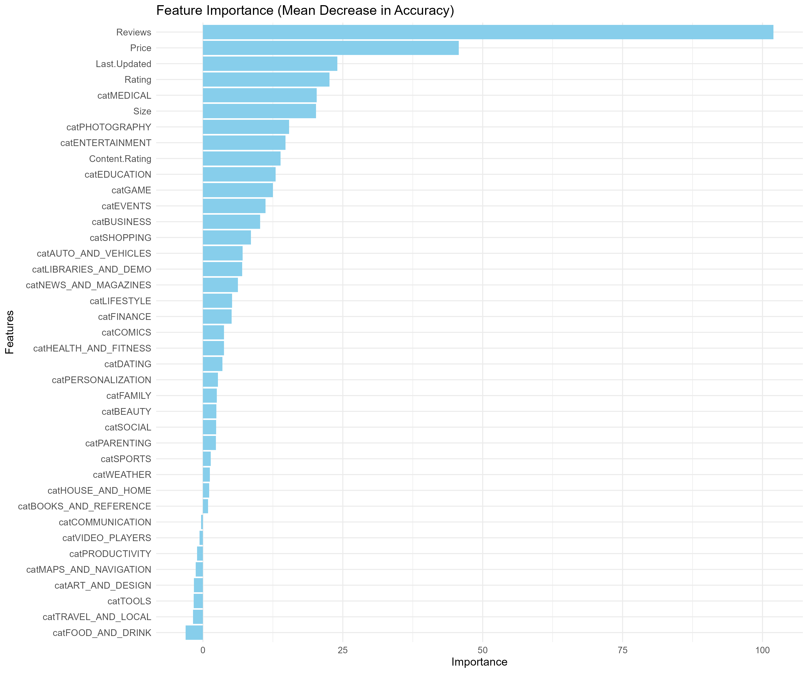{style="display: block; margin: 0 auto;"}

## XG Boost

### Why Gradient boost 
This project utilized a gradient boosting algorithm to predict "Low Installs" vs. "High Installs" for Play Store apps. Gradient boosting was chosen for its ability to handle complex relationships, mixed data types, and imbalanced datasets, while providing feature importance insights and high predictive power.                

### Modelling:
After the data has been divided into 80% training data and 20% testing data.Following are the parameters for building the model:

::: {style="text-align: justify;"}
-   Objective: The model is designed for binary classification
-   Evaluation metric:optimizing logloss 
-   max depth of 6 to control tree complexity, 
-   learning rate (ETA) of 0.1 for gradual training, 
-   subsample of 0.8 to reduce overfitting by sampling 80% of the data, and 
-   colsample_bytree set to 0.8 to randomize feature selection. 
::: 
These settings have balanced  model performance, generalization, and training stability.

### Confusion matrix:

::: {style="text-align: center;"}

**Figure 1**. Confusion Matrix of Gradient Boosting
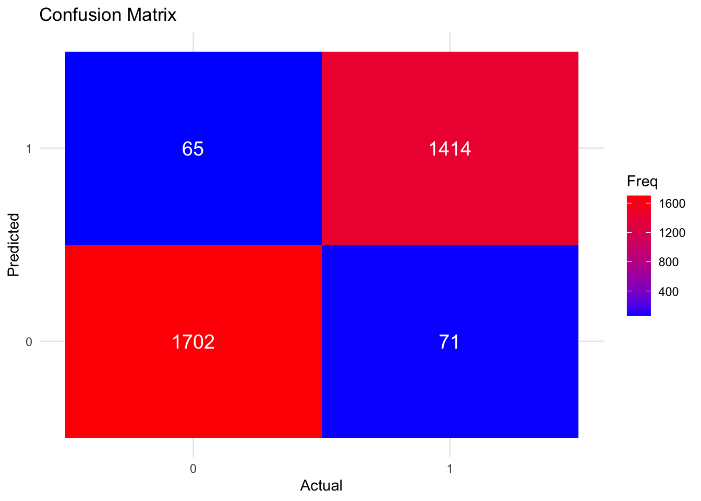
:::
The confusion matrix reveals notable classification challenges. The model accurately identifies 65 true positives and 71 true negatives but misclassifies a substantial number of cases: 1414 "Low Installs" as "High Installs" and 1702 "High Installs" as "Low Installs." These high misclassification rates indicate the model struggles to effectively differentiate between the two classes. This results in poor recall for "Low Installs" and low precision for "High Installs”.


### Evaluation of the model: 
For classification tasks, Gradient Boosting models are evaluated on their ability to predict categorical labels.

**Logloss:**

::: {style="text-align: center;"}

**Figure 2**. LogLoss over iterations
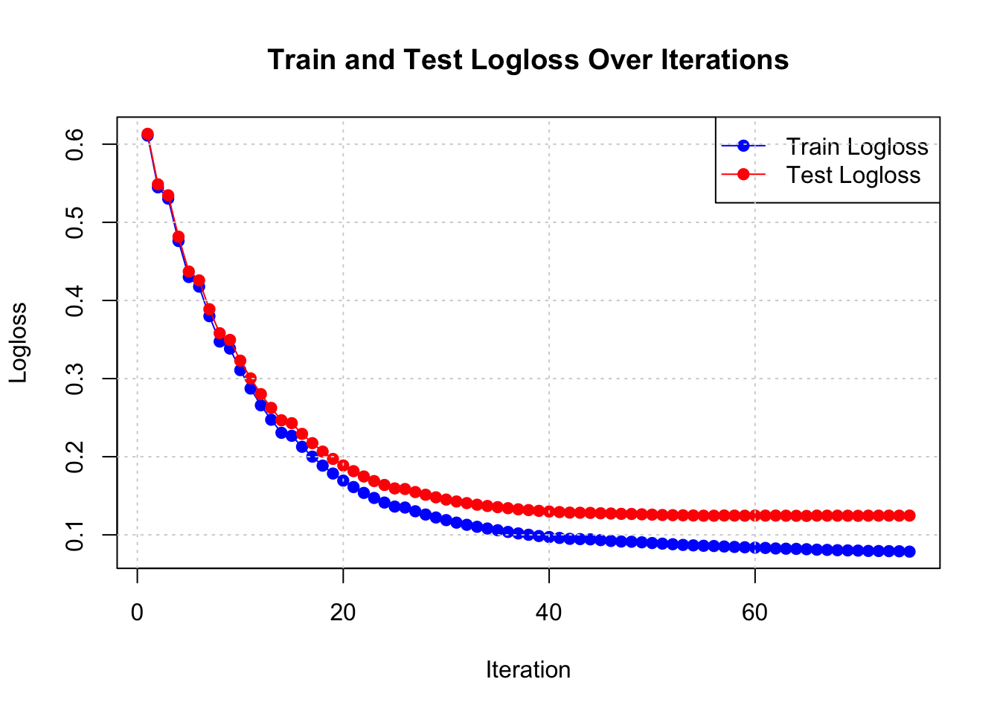
:::

Logloss evaluates classification models by measuring how close predicted probabilities are to actual class labels, with lower values indicating better performance. Monitoring overfitting involves checking if train-logloss decreases while test-logloss increases. In this model, train and test logloss values decrease with a slight gap, indicating minimal overfitting. Both curves plateau, signaling convergence and stable performance. The final logloss (~0.61) is moderate, with potential for improvement through tuning or adjustments to enhance predictive accuracy.


**ROC/AUC curve:**

::: {style="text-align: center;"}

**Figure 3**. ROC Curve for Gradient Boosting
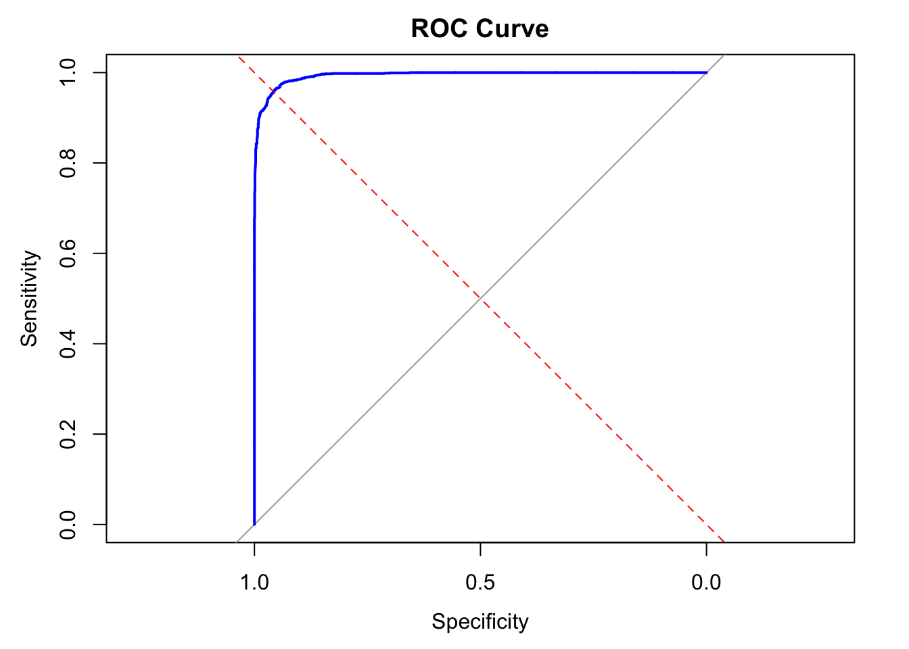
:::

The ROC curve demonstrates strong model performance, as the blue curve closely approaches the top-left corner, indicating high sensitivity and specificity. This signifies the model's excellent ability to distinguish between classes. The red dashed line represents random guessing, and the model's performance clearly surpasses this baseline. The area under the curve (AUC) would be high, reflecting robust discriminative capability. Overall, the ROC curve highlights the model's reliability in binary classification tasks.

**Accuracy, precision and recall:**

Accuracy (%):95.82
Precision(%): 96
Recall(%):96.32 


The model achieved strong overall performance, with an accuracy of 95.82%, precision of 96.00%, and recall of 96.32%. These metrics highlight the model's reliability in predicting "High Installs" while effectively minimizing false positives and false negatives.

### Feature importance:
::: {style="text-align: center;"}
**Figure 4**. Feature Importance of Gradient Boosting

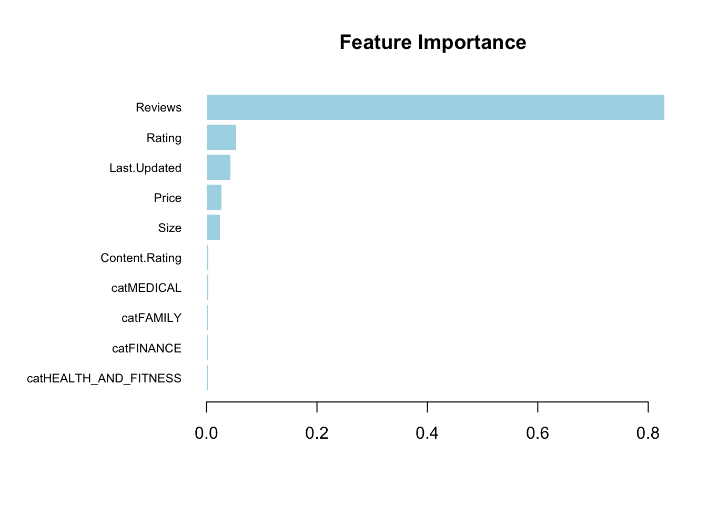

:::

*Reviews Dominance:* The high importance of Reviews suggests that the number of reviews is strongly correlated with the success metric. It might reflect the popularity or credibility of an app.

*Secondary Factors:* Rating, Last.Updated, Price, and Size might provide additional predictive power but are not as influential as Reviews.

*Categories:* The low importance of categorical features (catMEDICAL, catFAMILY, etc.) indicates that these categories do not contribute much to the predictive task. This might be due to insufficient variance or weak correlation with the target variable.

## Support Vector Machine (SVM)

Support Vector Machines (SVM) are supervised learning models used for classification and regression tasks. For this dataset, a **linear SVM** model was chosen.

### Why SVM?

The decision to use a linear SVM instead of a non-linear SVM was based on the observed **linear relationship** between variables, as indicated by the correlation matrix. Additionally, the linear SVM demonstrated higher accuracy compared to the non-linear SVM for this data.

Unlike logistic regression, SVM incorporates the concept of a **soft margin**. This allows for some misclassification to improve generalization. While this increases bias, it reduces variance, making SVM particularly effective when the boundary between classes is not perfectly clear.

### Advantages

SVM models are versatile and can be adjusted using their parameters to control flexibility. This adaptability makes them suitable for a variety of datasets. In addition, SVMs are effective for handling high-dimensional data and are robust to overfitting, especially when using appropriate regularization.

### Parameters

The linear SVM model has a key parameter, **C**, which controls the trade-off between margin width and classification error.  

- **Lower C values** create wider margins, allowing more misclassifications but increasing generalization.  

- **Higher C values** create narrower margins, aiming for more accurate classification but potentially leading to overfitting.  

In this case, **C = 1000** was selected because it yielded the lowest Mean Squared Error (MSE) compared to other values which indicates that the classes in data are more linearly separable as seen in Figure 6. This balance ensured an optimal trade-off between accuracy and model complexity.

::: {style="text-align: center;"}
**Figure 6**. Finding Optimal C using MSE
:::

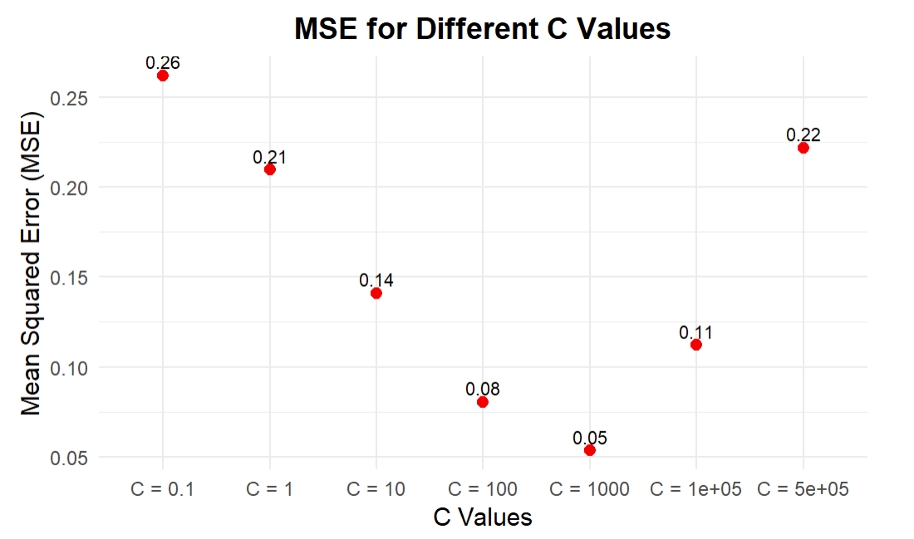

```         
Selection
```

# **Model Evaluation**

::: {style="text-align: justify;"}
Performance Metrics: Include accuracy, ROC-AUC, sensitivity,
specificity, and any other relevant metrics. Confusion Matrix: Summarize
performance using the confusion matrix. OOB Error: Discuss the OOB error
as an internal validation measure. Training vs. Testing Accuracy:
Analyze and compare performance on different datasets to check for
overfitting.
:::

## Logistic Model

### Confusion Matrix

The confusion matrix in Figure 7 shows that the model correctly classified 5763
instances of class 0 and 4580 instances of class 1, with 370 false
positives and 127 false negatives. The overall accuracy is 95.42%,
indicating a high proportion of correct predictions, with a 95%
confidence interval of (95.0%, 95.8%). The model achieves a Kappa
statistic of 0.9072, reflecting strong agreement beyond chance.
Sensitivity (recall for class 0) is 97.84%, and specificity (ability to
identify class 1) is 92.53%, showing balanced performance. Positive
predictive value (precision for class 0) is 93.97%, and negative
predictive value (precision for class 1) is 97.30%. The balanced
accuracy, accounting for both sensitivity and specificity, is 95.18%.
The McNemar's test p-value (\<2.2e-16) suggests significant differences
between misclassifications, and the prevalence of class 0 is 54.34%.

::: {style="text-align: center;"}
<<<<<<< HEAD
**Figure 1**. Confusion Matrix of Logistic Regression
=======
**Figure 7**. Confusion Matrix
>>>>>>> 50990e45b0a6525beadbcf0c1f717275661a6ae2
:::

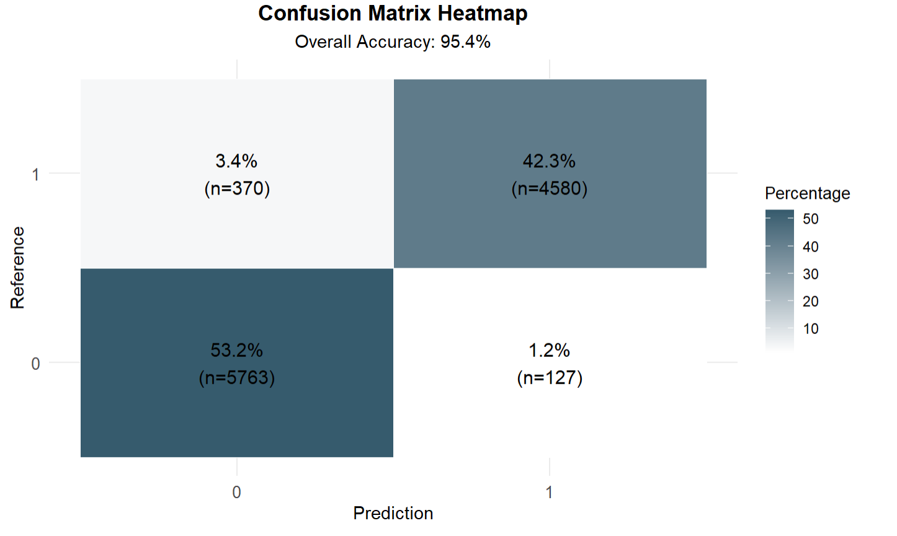{style="display: block; margin: 0 auto;"}

### Precision, Racall Rate, F1-Score

The model achieves a precision of 93.97%, indicating that 93.97% of the
predictions for class 0 are correct. Its recall is 97.84%, meaning the
model successfully identifies 97.84% of all actual class 0 instances.
The F1 score, which balances precision and recall, is 95.87%,
highlighting the model's strong overall performance in accurately and
consistently classifying instances of class 0. This combination of high
precision and recall reflects the model's effectiveness in minimizing
both false positives and false negatives.

### ROC-AUC

The model achieves an AUC (Area Under the Curve) score of 0.9923 as seen from Figure 8,
indicating excellent performance in distinguishing between classes. This
demonstrates the model's strong predictive power and effectiveness in
separating class 0 and class 1 instances.

::: {style="text-align: center;"}
**Figure 8**. ROC-AUC Curve
:::

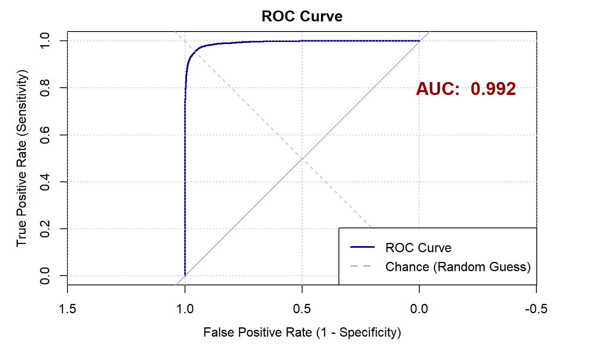{style="display: block; margin: 0 auto;"}

## Random FOrest Classifier

### Confusion Matrix
The Random Forest model correctly classified 4425 instances of class 0 and 2918 instances of class 1, with 171 false positives and 202 false negatives. This results in an overall accuracy of 95.4%, indicating a high proportion of correct predictions. The performance is consistent across datasets, with a training accuracy of 96.3%, testing accuracy of 95.4%, and an Out-Of-Bag (OOB) accuracy of 95.2%, reflecting the model's robustness and minimal overfitting.

::: {style="text-align: center;"}
**Figure 3**. Confusion Matrix of Random Forest
:::

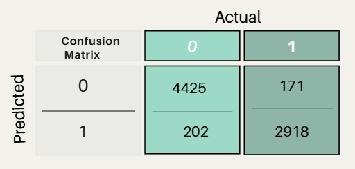{style="display: block; margin: 0 auto;"}

### Graph Analysis: Error Rates and Model Stability
The graph in the slide illustrates the error rates for the Random Forest model as the number of trees increases.

*Out-Of-Bag (OOB) Error:* The black line represents the OOB error rate, which stabilizes at a low level as the model grows more trees. This indicates that adding more trees contributes to better performance without overfitting.
*Class 1 and Class 2 Errors:* The red and green lines represent the error rates for class 1 and class 2, respectively. Both error rates decrease rapidly as the number of trees increases and stabilize, demonstrating the model's ability to effectively classify instances of both classes.
The error analysis shows that the model achieves convergence, with consistently low error rates across all classes, highlighting the reliability of the Random Forest classifier.
As, per the graph, the model is pretty reliable with generalizability.

::: {style="text-align: center;"}
**Figure 3**. Confusion Matrix of Random Forest
:::

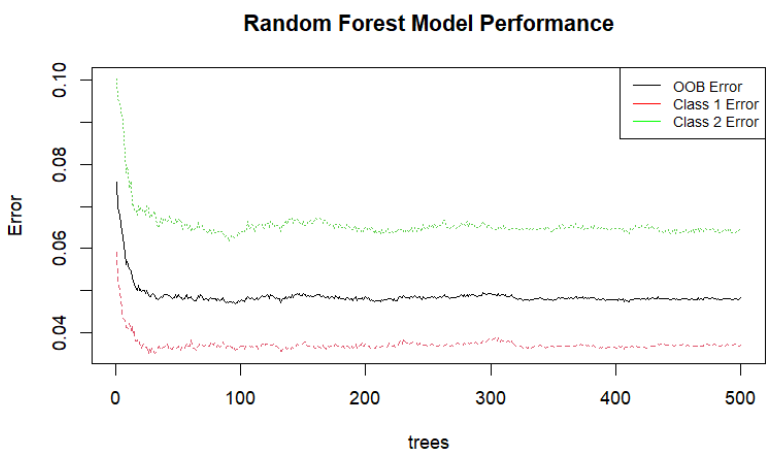{style="display: block; margin: 0 auto;"}

## SVM
### Confusion Matrix

::: {style="text-align: center;"}
**Figure 9**. Confusion Matrix
:::

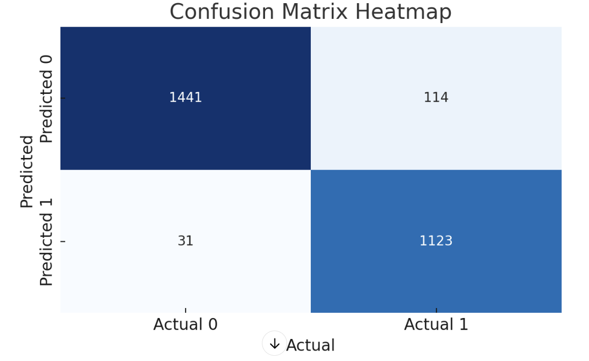
In Figure 9:

**Strong Classification**: The majority of predictions lie along the diagonal (True Negatives and True Positives), indicating that the model performs well in distinguishing between the two classes.

**Low Error Rates**: Off-diagonal elements (False Positives and False Negatives) are relatively small, suggesting minimal misclassification.

**Class Imbalance Impact**: A slightly higher number of True Negatives (1441) compared to True Positives (1123) may be attributed to a mild class imbalance, with slightly more instances belonging to class 0 than class 1.

**Balanced Performance**: Despite this imbalance, the model demonstrates effective handling of both classes, with errors distributed proportionally and no significant bias toward either class.

### Precision, Recall, and F1-Score

The model achieves a precision of **92.10%** for class 1, indicating that 92.10% of the predicted class 1 instances are correct. Its recall for class 1 is **97.33%**, meaning the model successfully identifies 97.33% of all actual class 1 instances.  

For class 0, the precision is **97.91%**, indicating that 97.91% of the predicted class 0 instances are correct, while the recall is **92.67%**, showing that 92.67% of all actual class 0 instances are correctly identified.  

The F1 score, which balances precision and recall, is **94.65%** for class 1 and **95.20%** for class 0, reflecting the model's strong overall performance. This combination of high precision and recall demonstrates the model's ability to minimize false positives and false negatives effectively, ensuring reliable and consistent classification.


### ROC

::: {style="text-align: center;"}
**Figure 10**. Confusion Matrix
:::

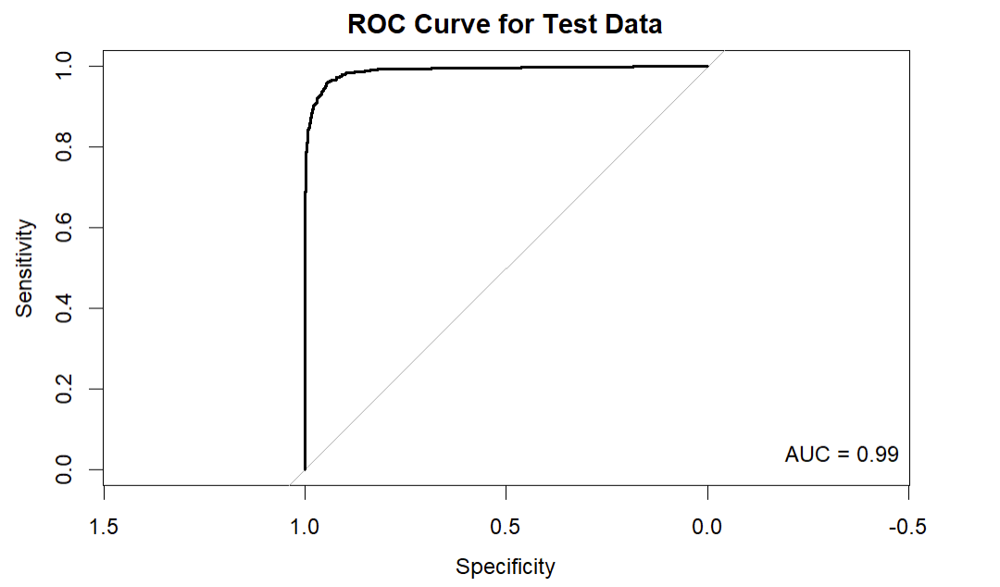

As observed from Figure 10, AUC values close to 1 suggest robust predictive capabilities, and in this case, the model excels at minimizing misclassification. These results confirm that the linear SVM is a suitable choice for this dataset, effectively capturing the linear relationships between variables while maintaining reliable generalization.

# **Predictions and Interpretability**

::: {style="text-align: justify;"}
Prediction Use Cases: Examples of actionable insights from the model
(e.g., predicting app install categories, identifying trends). Feature
Importance: Highlight the most significant predictors identified by the
model.

## SVM

### Insights from SVM model : 
Apps with high installs tend to share features such as higher review counts and potentially other engagement metrics  ratings and active user feedback. These factors should be a focal point in marketing strategies to boost installs.

### Feature Importance : 

::: {style="text-align: center;"}
**Figure 11**. Top Categories
:::

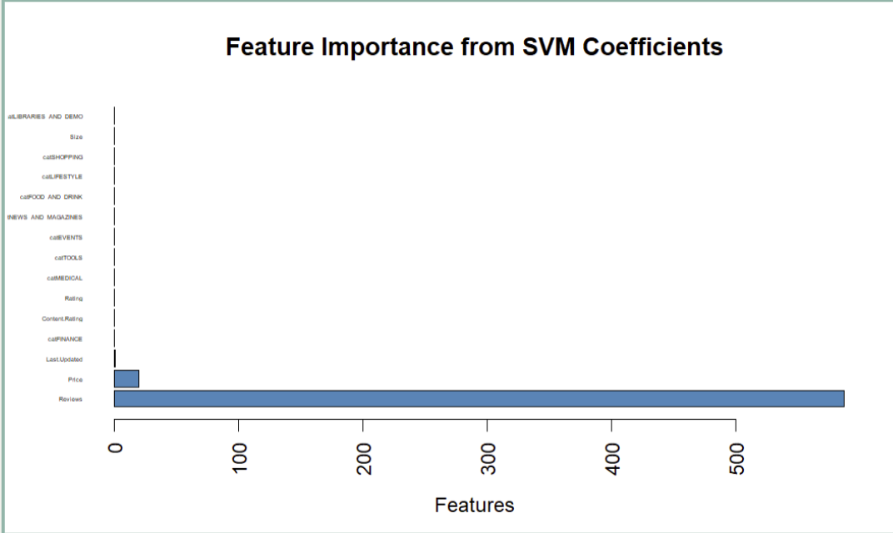


**Top 5 Features** :
The top five features influencing app installs are Reviews, Ratings, Last Updated, Price, and Size. Reviews are critical, as positive user feedback significantly enhances an app's appeal. Higher ratings correlate with increased installs, reflecting user satisfaction. Frequent updates signal active support and improvements, boosting user trust. Additionally, free or low-cost apps tend to attract more users, while lighter apps that occupy less storage are preferred. Focusing on these features can enhance an app's competitiveness in the market.

**Top 5 Categories** : 

The leading categories for app installs are Medical, Fitness, Finance, Family, and News & Magazines. These categories indicate a strong demand for practical applications that address everyday needs. Medical and Fitness apps highlight the focus on health, while Finance apps emphasize financial management. Family-oriented apps cater to safe and engaging content for households and are reachable for a broader range of audience, and News & Magazines apps fulfill the need for reliable information. Targeting these popular categories can create opportunities for higher installs and greater market reach.


:::

# **Reliability and Limitations**

::: {style="text-align: justify;"}
Reliability of Results: Discuss how reliable the results are, based on
metrics, cross-validation, and OOB error. *Limitations:* Bias in the
dataset. Model interpretability limitations. Potential overfitting.
Mitigation Strategies: Discuss how limitations were addressed (e.g.,
feature engineering, parameter tuning).

## SVM 

There is a slight indication of overfitting, as evidenced by the marginal difference between training and testing accuracies. While this overfitting is relatively minor and manageable, it is essential to monitor to ensure that the model maintains its generalization ability on unseen data.

Additionally, the interpretability of the model poses challenges, as SVMs often create complex decision boundaries that are difficult to understand

:::

# **Future Work**

::: {style="text-align: justify;"}

## SVM
Improvements: Suggest ways to improve the model, such as: Incorporating
additional data. Trying advanced algorithms or ensembles. Refining
features or engineering new ones. Further Analysis: Mention areas where
additional analysis could add value (e.g., testing for seasonality,
applying domain knowledge).

## SVM 

Expanding the dataset with diverse samples can improve generalization and reduce bias.

Trying algorithms like Random Forests or Gradient Boosting and using ensemble methods can enhance accuracy.

Conducting further feature engineering such as adding interaction terms to create new relevant features can capture hidden patterns and improve predictive capabilities.

:::

# **Conclusion**

::: {style="text-align: justify;"}
Summary of Findings: Summarize the outcomes and their implications.
Impact: Highlight the potential impact of your analysis and predictions.
:::

# **References**

::: {style="text-align: justify;"}
Use APA style to cite all sources.
:::
