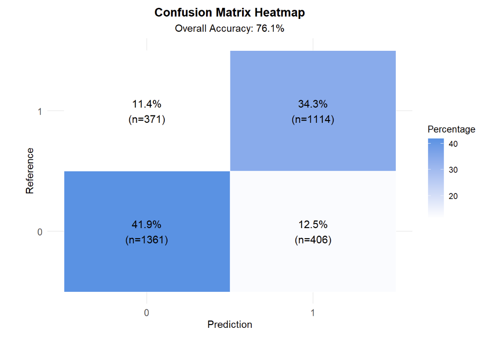
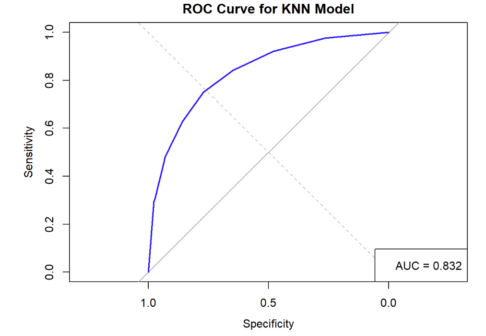
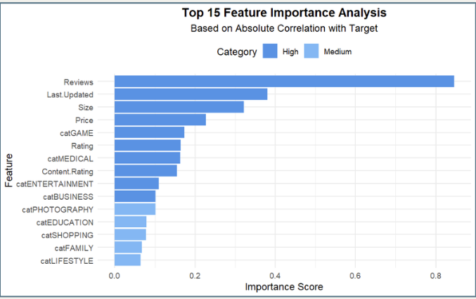

```{r setup, include=FALSE}
knitr::opts_chunk$set(warning = F, results = "markdown", message = F)
```

# **Introduction**

::: {style="text-align: justify;"}
In the fast-paced and competitive world of mobile applications,
understanding what makes an application successful is a pressing
challenge for developers, businesses, and researchers alike. With
Android dominating the mobile operating system landscape—powering over
2.5 billion active devices globally (Brandom, 2019)—the Google Play
Store has become the central hub for app distribution and user
engagement. Offering millions of applications across diverse categories,
the platform serves as an invaluable resource for analyzing user
behavior and preferences.

The key to an app's success lies in understanding the intricate
relationships between various features, such as app category, ratings,
reviews, content suitability, and technical compatibility. Identifying
patterns within these factors enables developers to design apps that
align with user expectations, thereby increasing downloads, engagement,
and retention rates. In this project, we leverage the comprehensive
dataset from the Google Play Store to predict app success based on these
features.

To address this problem, we have adopted a robust machine learning
approach, employing and comparing multiple classification models,
including Logistic Regression, k-Nearest Neighbors (kNN), Random Forest,
Support Vector Machines (SVM), and Extreme Gradient Boosting (XGBoost).
By systematically evaluating the performance of these models, we aim to
determine the most effective classifier for predicting app success.

This analysis not only provides actionable insights for app developers
and stakeholders but also contributes to the broader understanding of
user dynamics and preferences in the app ecosystem. Through this
research, we aim to bridge the gap between user expectations and app
design, empowering developers to make data-driven decisions that enhance
user satisfaction and engagement.
:::

# **Exploratory Data Analysis (EDA)**

### Dataset Overview

::: {style="text-align: justify;"}
The dataset used in this study is a popular collection of Google Play
Store apps, sourced from Kaggle (faisaljanjua0555, 2023). It contains
detailed information about 10,841 apps, organized across 13 variables,
with each row representing an individual app. The dataset covers a range
of app attributes, such as ratings, reviews, size, category, installs,
price, and content rating, providing valuable insights into the
characteristics that contribute to app popularity and user engagement.
This comprehensive data serves as a foundation for analyzing patterns in
user behavior, app performance, and trends within the mobile app
ecosystem.
:::

### Data Cleaning

::: {style="text-align: justify;"}
The Google Play Store dataset, as analyzed, contains missing values and
inconsistent formats across various columns. To clean and prepare this
dataset for analysis, several steps were taken to address these data
quality issues. Here is an overview of how missing records were managed
and further improvements that could be considered:

-   Duplicates: Removed 1,181 duplicate apps, reducing the dataset from
    10,841 to 9,660 unique apps to eliminate redundancy.
-   Price: Cleaned dollar symbols for numeric conversion and removed
    rows with missing or blank prices.
-   Type: Replaced one missing value with "Free" based on a logical
    inference.
-   Size: Standardized sizes (KB/MB) and replaced "Varies with device"
    entries with mean sizes by category.
-   Installs: Removed symbols (+, commas) and cleaned non-numeric
    entries for numeric conversion.
-   Rating & Reviews: Imputed 1,463 missing ratings with category-wise
    means; converted reviews to integer format.
-   Last Updated: Standardized date format for accuracy.
-   Category & Genres: Retained Category while removing redundant Genres
    for clarity.
-   Current Version: Excluded due to inconsistencies across records.
-   Android Version: Removed two rows with 'NaN' values.

Additional Transformations:

-   Review & Install Categories: Binned data for balanced representation
    across reviews and installs.
-   Log Transformed Installs: Applied log transformation to normalize
    install data and reduce skewness.
-   Update Category: Classified updates as "Old" or "Recent" to analyze
    the impact on performance metrics.
:::

## Data Visualizations

::: {style="text-align: center;"}
**Figure 1**. Installs vs Category
:::


From Figure 1, it could be observed that the top 5 categories having
highest Installs are Game, Communication, Tools, Productivity, Social.

::: {style="text-align: center;"}
**Figure 2**. Installs vs Reviews
:::


From Figure 2, It is evident that for higher Reviews the installs range
is higher, indicating higher Installs for higher Reviews.

::: {style="text-align: center;"}
**Figure 3**. Installs vs Rating
:::

 From Figure 3, It could be seen that for
high installs the ratings are clustered in the higher range

::: {style="text-align: center;"}
**Figure 4**. Installs vs Price
:::


From Figure 4, The installs are higher for apps which are free and
decrease in installs as the price increases, indicating better to have a
free app for high installs.

# **Data Pre-processing**

::: {style="text-align: justify;"}
-   *Category Encoding*<br> The Category column was transformed into
    dummy variables using model.matrix(), and the original column was
    removed. Column names were standardized by replacing spaces with
    underscores.
-   *Installs Classification*<br> The Installs column was converted into
    a binary variable (Low Installs as 0 and High Installs as 1) based
    on the median value. A histogram was created to visualize the
    distribution of categories.
-   *Last Updated Transformation*<br> The Last.Updated column was
    converted into numeric values representing the days since the most
    recent update, ensuring a quantitative measure of recency.
:::

##### 

# **SMART Question**

::: {style="text-align: justify;"}
> **Which are the top 5 app categories, as identified by classification
> models (logistic regression, SVM, XGBoost, KNN, and random forest),
> that significantly influenced app success (measured by installs) based
> on app data from 2010 to 2018, and how accurately can these models
> predict success trends within this time period?**
:::

::: {style="text-align: justify;"}
We chose "Installs" as our target variable because the visualizations
indicate that it is strongly correlated with several key features,
including Reviews, Ratings, Price, and Size. These correlations suggest
that the number of installs plays a crucial role in determining an app's
success. More installs are associated with increased user engagement,
reflected in higher reviews and ratings. Considering these factors,
focusing on "Installs" as the target variable aligns with the objective
of optimizing app performance and success.
:::

# **Model's Development Process**

## Logistic Regression

### Why Logistic Regression?

The Logistic Regression model is considered because it is an
interpretable model commonly used for classification tasks. In this
project, the target variable is binary (Low or High Installs). It
estimates the probability of an outcome, providing clear insights into
the relationship between predictors and the target variable through
interpretable coefficients. Additionally, logistic regression performs
well with proper preprocessing and effectively handles multicollinearity
and feature selection using regularization techniques. While it may not
be ideal for capturing complex, non-linear relationships, logistic
regression serves as a strong baseline for this problem.

### Advantages

Logistic regression is a simple yet powerful statistical method widely
used for binary classification tasks. It is easy to implement,
computationally efficient, and highly interpretable, as its coefficients
indicate the influence of predictors on the target variable. Logistic
regression provides probabilistic outputs, making it ideal for
threshold-based decision-making and ranking. It works well with small
datasets, is robust to multicollinearity, and does not require
predictors to be normally distributed or linearly related to the target.
The model supports regularization techniques like L1 and L2 to address
overfitting and perform feature selection. Additionally, it serves as an
excellent baseline for benchmarking classification problems and can be
extended to handle multi-class and ordered outcomes. With wide
applicability across fields such as medicine, finance, and marketing,
logistic regression remains a fundamental tool for predictive modeling.

### Confusion Matrix

The confusion matrix in Figure 6 shows that the model correctly
classified 5763 instances of class 0 and 4580 instances of class 1, with
370 false positives and 127 false negatives. The overall accuracy is
95.42%, indicating a high proportion of correct predictions, with a 95%
confidence interval of (95.0%, 95.8%). The model achieves a Kappa
statistic of 0.9072, reflecting strong agreement beyond chance.
Sensitivity (recall for class 0) is 97.84%, and specificity (ability to
identify class 1) is 92.53%, showing balanced performance. Positive
predictive value (precision for class 0) is 93.97%, and negative
predictive value (precision for class 1) is 97.30%. The balanced
accuracy, accounting for both sensitivity and specificity, is 95.18%.
The McNemar's test p-value (\<2.2e-16) suggests significant differences
between misclassifications, and the prevalence of class 0 is 54.34%.

::: {style="text-align: center;"}
**Figure 6**. Confusion Matrix
:::

{style="display: block; margin: 0 auto;"}

### Precision, Racall Rate, F1-Score

The model achieves a precision of 93.97%, indicating that 93.97% of the
predictions for class 0 are correct. Its recall is 97.84%, meaning the
model successfully identifies 97.84% of all actual class 0 instances.
The F1 score, which balances precision and recall, is 95.87%,
highlighting the model's strong overall performance in accurately and
consistently classifying instances of class 0. This combination of high
precision and recall reflects the model's effectiveness in minimizing
both false positives and false negatives.

### ROC-AUC

The model achieves an AUC (Area Under the Curve) score of 0.9923 as seen
from Figure 7, indicating excellent performance in distinguishing
between classes. This demonstrates the model's strong predictive power
and effectiveness in separating class 0 and class 1 instances.

::: {style="text-align: center;"}
**Figure 7**. ROC-AUC Curve
:::

{style="display: block; margin: 0 auto;"}


### Feature Importance :

The initial logistic model includes all 39 variables and has the AIC
value of 2881.6. The stepwise selection is proceeded based on this
logistic model. The result shows that the stepwise model has AIC value
of 2850, indicating that this model performs better than the initial
model. The stepwise model includes 16 out of 39 variables: `Rating`,
`Reviews`, `Price`, `Content.Rating`, `Last.Updated`, `catBUSINESS`,
`catEDUCATION`, `catEVENTS`, `catFINANCE`, `catHOUSE_AND_HOME`,
`catMAPS_AND_NAVIGATION`, `catMEDICAL`, `catNEWS_AND_MAGAZINES` ,
`catPHOTOGRAPHY`, `catSPORTS`, `catVIDEO_PLAYERS`, `catPERSONALIZATION`,
`catBEAUTY`, `catPARENTING.`

In Figure 14., from this stepwise model, the top five importance features
from this model is: `Review`, `Price`, `Rating`, `Last.Updated`, and
`Content.Rating`. The top 5 categories that have most impacted in this
model is `FINANCE`, `PHOTOGRAPHY`, `EDUCATION`, `MEDICAL` and
`HOUSE_AND_HOME`.

::: {style="text-align: center;"}
**Figure 14**. Top 10 Important Features
:::

{style="display: block; margin: 0 auto;"}


## K-Nearest Neighbors

### Why KNN?

The decision to use **K-Nearest Neighbors (KNN)** was motivated by the need to examine whether the data exhibited a **non-linear relationship** and to explore if the data could naturally form clusters rather than adhering to a linear classification boundary. KNN is particularly effective for data with non-linear patterns due to its instance-based approach, where decisions are made locally using the nearest neighbors.

### Confusion Matrix

::: {style="text-align: center;"}
**Figure 8**. Confusion Matrix
:::

 


### Parameters

The **KNN parameter `K`** plays a crucial role in determining the model's performance:  

- **Optimal Value of `K`**:  
  - The value of `K` was optimized using a **cross-validation technique** to evaluate accuracy for different values of `K`.  
  - After testing, the optimal value was found to be **`K = 7`**, having the highest accuracy

- **Distance Metric**:  
The **Euclidean Distance** was utilized as the distance measure, as this metric calculates the straight-line distance between points in the feature space, making it suitable for continuous numerical data as most of our data is numerical data


### Advantages

The KNN model achieved an accuracy of **76%**, which indicates that:

- The relationship between the variables is **non-linear**, confirming the initial hypothesis.

### Confusion Matrix

::: {style="text-align: center;"}
**Figure 8**. Confusion Matrix
:::

 


In Figure 8:

### Model Performance Summary

**Moderate Classification**: The model achieves a moderate level of accuracy with 1361 True Negatives and 1114 True Positives, indicating some success but also limitations.

**Significant Misclassification**: A total of 371 False Positives and 406 False Negatives suggest notable misclassification and a need for refinement.

**Class Imbalance Issues**: The slight imbalance between classes may hinder effective generalization, impacting the model's predictive capabilities.

**Inconsistent Performance**: The model shows weakness in identifying class 1, as evidenced by the high False Negatives, reflecting areas for improvement.


### Precision, Recall, and F1-Score


The model achieves a precision of **78.57%**, indicating that 78.57% of the predicted instances are correct. While this is a positive indication, it falls below the desired threshold of 80%.

The overall accuracy is **76.10%**, reflecting the model's correctness in predictions, but again, it does not meet the 80% benchmark.

The recall is measured at **77.02%**, meaning the model successfully identifies 77.02% of all actual instances, which suggests some room for improvement in capturing all relevant cases.

Finally, the F1 score, which balances precision and recall, stands at **77.79%**. This metric indicates a moderate performance level, highlighting the need for enhancements to minimize false positives and false negatives for more consistent classification.


### ROC

::: {style="text-align: center;"}
**Figure 9**. ROC Curve
:::



As observed from Figure 9, the KNN model achieves an AUC of **0.832**, indicating moderate predictive capabilities. This performance suggests room for improvement, possibly due to linear relationships between the variables that KNN may not fully leverage.


### Feature Importance :

Apps with high installs tend to share features such as higher review
counts and More frequent updates. These factors should be a focal point in marketing strategies
to boost installs.


::: {style="text-align: center;"}
**Figure 15**. Top Categories
:::



**Top 5 Features**
Features like **Reviews**, **Last Updated**, and **Size** have the highest importance, indicating they strongly influence the classification of apps into low or high installs.

**Top 5 Categories**
Features derived from categorical variables (e.g., **catGAME**, **catBUSINESS**) show moderate importance, reflecting the varying impact of app categories.


## Random Forest Classifier

### Why Random Forest?

The Random Forest classifier is considered because it is a robust and
flexible model that performs well in classification tasks, such as in
this project, where the target variable is binary (Low or High
Installs). It combines multiple decision trees to produce a more
accurate and stable prediction through an ensemble approach. Random
Forest handles non-linear relationships effectively and is resistant to
overfitting due to its random sampling and feature selection techniques.
Additionally, it provides insights into feature importance, which can
guide further analysis and feature selection.

### Modelling

The initial Random Forest model was built using all 39 variables, and
its performance metrics, such as accuracy and F1-score, demonstrated its
strong classification capability. To optimize the model, hyperparameter
tuning was conducted to balance complexity and accuracy. Key parameters
such as mtry (number of features considered at each split), ntree
(number of trees in the forest), and nodesize (minimum size of terminal
nodes) were fine-tuned. The tuning process evaluated mtry values of 2,
4, 6, 8, and 10, with the optimal value determined to be 4, which
significantly reduced the model's tendency to overfit. Adjusting these
parameters ensured a better generalization of the model while
maintaining high classification accuracy.

### Advantages

Random Forest offers several advantages that make it a strong candidate
for classification tasks. It is highly robust and capable of modeling
complex, non-linear relationships by aggregating results from multiple
decision trees. This ensemble approach reduces the risk of overfitting,
especially with proper parameter tuning. Additionally, the model
provides feature importance rankings, offering insights into the
predictors most relevant to the outcome. Random Forest performs well
with large datasets and can handle a mix of categorical and continuous
variables without requiring extensive preprocessing. Its ability to
handle missing data and reduce variance through bootstrapping further
enhances its reliability in predictive modeling tasks.

### Confusion Matrix

The Random Forest model correctly classified 4425 instances of class 0
and 2918 instances of class 1, with 171 false positives and 202 false
negatives. This results in an overall accuracy of 95.4%, indicating a
high proportion of correct predictions. The performance is consistent
across datasets, with a training accuracy of 96.3%, testing accuracy of
95.4%, and an Out-Of-Bag (OOB) accuracy of 95.2%, reflecting the model's
robustness and minimal overfitting.

::: {style="text-align: center;"}
**Figure 10**. Confusion Matrix of Random Forest
:::

{style="display: block; margin: 0 auto;"}


### Graph Analysis: Error Rates and Model Stability

The graph in the slide illustrates the error rates for the Random Forest
model as the number of trees increases.

*Out-Of-Bag (OOB) Error:* The black line represents the OOB error rate,
which stabilizes at a low level as the model grows more trees. This
indicates that adding more trees contributes to better performance
without overfitting. *Class 1 and Class 2 Errors:* The red and green
lines represent the error rates for class 1 and class 2, respectively.
Both error rates decrease rapidly as the number of trees increases and
stabilize, demonstrating the model's ability to effectively classify
instances of both classes. The error analysis shows that the model
achieves convergence, with consistently low error rates across all
classes, highlighting the reliability of the Random Forest classifier.
As, per the graph, the model is pretty reliable with generalizability.

::: {style="text-align: center;"}
**Figure 11**. Confusion Matrix of Random Forest
:::

{style="display: block; margin: 0 auto;"}


### Feature Importance :

In Figure 16., from the mean decrease accuracy values, the top five
importance features from this model is: 'Reviews', 'Price', 'Rating',
'Last.Updated', 'Size'. The top 5 categories that have most impacted in
this model is 'cat_MEDICAL', 'cat_EVENTS', 'cat_ENTERTAINMENT',
'cat_EDUCATION', 'cat_BUSINESS', and 'cat_GAME'.

::: {style="text-align: center;"}
**Figure 16**. Top 10 Important Features for Random Forest Classifier
:::

{style="display: block; margin: 0 auto;"}


## XG Boost

### Why Gradient boost

This project utilized a gradient boosting algorithm to predict "Low
Installs" vs. "High Installs" for Play Store apps. Gradient boosting was
chosen for its ability to handle complex relationships, mixed data
types, and imbalanced datasets, while providing feature importance
insights and high predictive power.

### Modelling:

After the data has been divided into 80% training data and 20% testing
data.Following are the parameters for building the model:

::: {style="text-align: justify;"}
-   Objective: The model is designed for binary classification
-   Evaluation metric:optimizing logloss
-   max depth of 6 to control tree complexity,
-   learning rate (ETA) of 0.1 for gradual training,
-   subsample of 0.8 to reduce overfitting by sampling 80% of the data,
    and
-   colsample_bytree set to 0.8 to randomize feature selection.
:::

These settings have balanced model performance, generalization, and
training stability.

### Confusion matrix:

::: {style="text-align: center;"}
**Figure 11**. Confusion Matrix of Gradient Boosting


The confusion matrix reveals notable classification challenges. The
model accurately identifies 65 true positives and 71 true negatives but
misclassifies a substantial number of cases: 1414 "Low Installs" as
"High Installs" and 1702 "High Installs" as "Low Installs." These high
misclassification rates indicate the model struggles to effectively
differentiate between the two classes. This results in poor recall for
"Low Installs" and low precision for "High Installs”.

### Evaluation of the model:

For classification tasks, Gradient Boosting models are evaluated on
their ability to predict categorical labels.

**Logloss:**

::: {style="text-align: center;"}
**Figure 12**. LogLoss over iterations 
:::

Logloss evaluates classification models by measuring how close predicted
probabilities are to actual class labels, with lower values indicating
better performance. Monitoring overfitting involves checking if
train-logloss decreases while test-logloss increases. In this model,
train and test logloss values decrease with a slight gap, indicating
minimal overfitting. Both curves plateau, signaling convergence and
stable performance. The final logloss (\~0.61) is moderate, with
potential for improvement through tuning or adjustments to enhance
predictive accuracy.

**ROC/AUC curve:**

::: {style="text-align: center;"}
**Figure 13**. ROC Curve for Gradient Boosting 
:::

The ROC curve demonstrates strong model performance, as the blue curve
closely approaches the top-left corner, indicating high sensitivity and
specificity. This signifies the model's excellent ability to distinguish
between classes. The red dashed line represents random guessing, and the
model's performance clearly surpasses this baseline. The area under the
curve (AUC) would be high, reflecting robust discriminative capability.
Overall, the ROC curve highlights the model's reliability in binary
classification tasks.

**Accuracy, precision and recall:**

Accuracy (%):95.82 Precision(%): 96 Recall(%):96.32

The model achieved strong overall performance, with an accuracy of
95.82%, precision of 96.00%, and recall of 96.32%. These metrics
highlight the model's reliability in predicting "High Installs" while
effectively minimizing false positives and false negatives.

### Feature importance :

::: {style="text-align: center;"}
**Figure 18**. Feature Importance of Gradient Boosting


:::

*Reviews Dominance:* The high importance of Reviews suggests that the
number of reviews is strongly correlated with the success metric. It
might reflect the popularity or credibility of an app.

*Secondary Factors:* Rating, Last.Updated, Price, and Size might provide
additional predictive power but are not as influential as Reviews.

*Categories:* The low importance of categorical features (catMEDICAL,
catFAMILY, etc.) indicates that these categories do not contribute much
to the predictive task. This might be due to insufficient variance or
weak correlation with the target variable.
:::::::


## Support Vector Machine (SVM)

Support Vector Machines (SVM) are supervised learning models used for
classification and regression tasks. For this dataset, a **linear SVM**
model was chosen.

### Why SVM?

The decision to use a linear SVM instead of a non-linear SVM was based
on the observed **linear relationship** between variables, as indicated
by the correlation matrix. Additionally, the linear SVM demonstrated
higher accuracy compared to the non-linear SVM for this data.

Unlike logistic regression, SVM incorporates the concept of a **soft
margin**. This allows for some misclassification to improve
generalization. While this increases bias, it reduces variance, making
SVM particularly effective when the boundary between classes is not
perfectly clear.

### Advantages

SVM models are versatile and can be adjusted using their parameters to
control flexibility. This adaptability makes them suitable for a variety
of datasets. In addition, SVMs are effective for handling
high-dimensional data and are robust to overfitting, especially when
using appropriate regularization.

### Parameters

The linear SVM model has a key parameter, **C**, which controls the
trade-off between margin width and classification error.

-   **Lower C values** create wider margins, allowing more
    misclassifications but increasing generalization.

-   **Higher C values** create narrower margins, aiming for more
    accurate classification but potentially leading to overfitting.

In this case, **C = 1000** was selected because it yielded the lowest
Mean Squared Error (MSE) compared to other values which indicates that
the classes in data are more linearly separable as seen in Figure 5.
This balance ensured an optimal trade-off between accuracy and model
complexity.

::: {style="text-align: center;"}
**Figure 5**. Finding Optimal C using MSE
:::


### Confusion Matrix

::: {style="text-align: center;"}
**Figure 9**. Confusion Matrix
:::

 


In Figure 9:

**Strong Classification**: The majority of predictions lie along the
diagonal (True Negatives and True Positives), indicating that the model
performs well in distinguishing between the two classes.

**Low Error Rates**: Off-diagonal elements (False Positives and False
Negatives) are relatively small, suggesting minimal misclassification.

**Class Imbalance Impact**: A slightly higher number of True Negatives
(1441) compared to True Positives (1123) may be attributed to a mild
class imbalance, with slightly more instances belonging to class 0 than
class 1.

**Balanced Performance**: Despite this imbalance, the model demonstrates
effective handling of both classes, with errors distributed
proportionally and no significant bias toward either class.

### Precision, Recall, and F1-Score

The model achieves a precision of **92.10%** for class 1, indicating
that 92.10% of the predicted class 1 instances are correct. Its recall
for class 1 is **97.33%**, meaning the model successfully identifies
97.33% of all actual class 1 instances.

For class 0, the precision is **97.91%**, indicating that 97.91% of the
predicted class 0 instances are correct, while the recall is **92.67%**,
showing that 92.67% of all actual class 0 instances are correctly
identified.

The F1 score, which balances precision and recall, is **94.65%** for
class 1 and **95.20%** for class 0, reflecting the model's strong
overall performance. This combination of high precision and recall
demonstrates the model's ability to minimize false positives and false
negatives effectively, ensuring reliable and consistent classification.

### ROC

::: {style="text-align: center;"}
**Figure 10**. ROC Curve
:::


### Insights from SVM model :

Apps with high installs tend to share features such as higher review
counts and potentially other engagement metrics auch as ratings and active user
feedback. These factors should be a focal point in marketing strategies
to boost installs.


### Feature Importance :

::: {style="text-align: center;"}
**Figure 17**. Top Categories
:::


**
As observed from Figure 10, AUC values close to 1 suggest robust
predictive capabilities, and in this case, the model excels at
minimizing misclassification. These results confirm that the linear SVM
is a suitable choice for this dataset, effectively capturing the linear
relationships between variables while maintaining reliable
generalization.
**
:::


## Overall

The table below compares the performance of five machine learning
models—Logistic Regression, KNN, Random Forest, Gradient Boost, and
SVM—across various evaluation metrics, including Accuracy, Precision,
Recall, F1 Score, and AUC-ROC Score. Gradient Boost emerges as the
top-performing model in most categories, achieving the highest values
for Accuracy (0.9581), Precision (0.96), F1 Score (0.96), and AUC-ROC
Score (0.99), while SVM also performs exceptionally well, particularly
in Recall (0.978) and AUC-ROC Score (0.99). Logistic Regression
demonstrates strong performance, particularly with an AUC-ROC Score of
0.990 and a low overfitting tendency, alongside high interpretability.
Random Forest shows robust results across all metrics but has a moderate
overfitting tendency. In contrast, KNN lags behind the other models,
showing lower scores across most metrics.

While Gradient Boost demonstrates better performance across several
evaluation metrics, Logistic Regression proves to be a more suitable
model for practical applications. This is attributed to the moderate
overfitting tendency and moderate interpretability of Gradient Boost,
which may limit its reliability in certain scenarios. In contrast,
Logistic Regression exhibits a low tendency to overfit and offers high
interpretability, making it a more robust and transparent choice for
research and real-world implementation.

| Attribute/Metric | Logistic Regression | KNN | Random Forest | Gradient Boost | SVM |
|:-------------:|:---------:|:--------:|:----------:|:-----------:|:-------:|
| Accuracy | 0.948 | 0.76 | 0.9517 | 0.9581 | 0.946 |
| Precision | 0.933 | 0.7857 | 0.955 | 0.96 | 0.926 |
| Recall | 0.973 | 0.7702 | 0.962 | 0.96 | 0.978 |
| F1-Score | 0.953 | 0.7779 | 0.959 | 0.96 | 0.952 |
| AUC-ROC | 0.990 | 0.832 | 0.981 | 0.99 | 0.99 |
| Overfitting Tendency | Low | Low | Moderate | Moderate | Low |
| Interpretability | High | Moderate | Moderate | Moderate | Moderate |

# **Predictions and Interpretability**

::::::: {style="text-align: justify;"}

**Top 5 Features**: The key features influencing app installs are Reviews, Ratings, Last Updated, Price, and Size. Positive Reviews enhance appeal, while higher Ratings indicate user satisfaction. Frequent updates build trust, and free or low-cost apps attract more users. Additionally, smaller apps that occupy less storage are preferred. Focusing on these aspects can improve an app's market competitiveness.

**Top 5 Categories**: The most popular app categories are Medical, Fitness, Finance, Family, and News & Magazines. These categories reflect a strong demand for practical solutions. Medical and Fitness apps prioritize health, Finance apps focus on financial management, Family apps provide safe content for households, and News & Magazines apps offer reliable information. Targeting these categories can lead to higher installs and broader market reach.


# **Reliability and Limitations**

::: {style="text-align: justify;"}

### Reliability

*Model Robustness:* The use of ensemble techniques like Random Forest
and XGBoost enhances the reliability of predictions by aggregating
multiple decision paths and reducing overfitting.

*Feature Importance*: All the models provide insights into feature
importance, which adds transparency to the decision-making process.

*Balanced Data Representation:* Data cleaning and transformations, such
as binning and log transformations, ensured a more balanced
representation of key features, improving the reliability of model
outputs.

### Limitations

*Dataset Size and Scope:* Although comprehensive, the dataset is limited
to apps listed on the Google Play Store between 2010 and 2018,
potentially omitting recent trends and app categories.

*Imputed Data:* The imputation of missing values, while necessary, may
introduce bias or inaccuracies in the analysis.

*Static Analysis:* The study does not consider temporal trends, such as
changes in user preferences or technological advancements over time.

*Model Limitations:* Despite their strengths, models like Random Forest
and XGBoost can be computationally intensive and may lack
interpretability compared to simpler methods like Logistic Regression.

:::

# **Future Work**

::: {style="text-align: justify;"}
1.  Incorporate Temporal Dynamics: Future research could include
    time-series analysis to capture evolving trends in app success and
    user preferences.

2.  Advanced Feature Engineering: Explore additional features, such as
    user demographics, sentiment analysis of reviews, and app update
    frequency.

3.  Explainable AI: Implement interpretability techniques, such as SHAP
    values, to provide deeper insights into model predictions and
    improve stakeholder trust.

4.  Real-Time Prediction: Develop pipelines for real-time prediction and
    monitoring of app success metrics using streaming data.
:::

# **Conclusion**

Developers and stakeholders can leverage these insights to make
data-driven decisions and prioritize features and strategies that have
the greatest impact on driving app installs. Enhancing user reviews and
ratings is crucial for building trust and credibility among users, while
optimizing app size ensures smooth downloads and seamless usage,
improving user experience. Additionally, adopting a low-pricing strategy
can help attract a broader user base, making the app more accessible and
appealing in competitive markets.

Furthermore, focusing on high-importance categories such as Games,
Medical, Entertainment, Finance, and Photography can significantly
improve market traction. These categories have proven to be particularly
influential in determining app success, offering greater opportunities
for user engagement and growth. By aligning their efforts with these
findings, developers can better meet user expectations, enhance overall
app performance, and gain a competitive advantage in the rapidly
evolving app marketplace.

# **References**

::: {style="text-align: justify;"}
P.Charuza[Online].Available: <https://fueled.com/blog/much->
money-can-earn-app [Accessed 19 Nov 2018].

“kaggle”[Online].Available:<https://www.kaggle.com/lava18/goo>
gle-play-store-apps [Accessed 16 Nov 2018].

Y. Tian, M. Nagappan, D. Lo, and A. E. Hassan, “What are the charac-
teristics of high-rated apps? a case study on free android
applications,” in Software Maintenance and Evolution (ICSME), 2015 IEEE
International Conference on, Sept 2015, pp. 301–310.

L.Guerrouj,S.Azad,andP.C.Rigby,“Theinfluenceofappchurnonapp success and
stackoverflow discussions,” in 2015 IEEE 22nd International Conference
on Software Analysis, Evolution, and Reengineering (SANER), March 2015,
pp. 321–330.
:::
