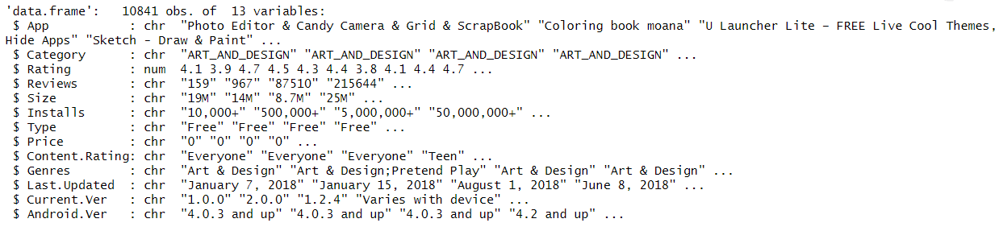

```{r setup, include=FALSE}
knitr::opts_chunk$set(warning = F, results = "markdown", message = F)
```

# Introduction

In the rapidly evolving smartphone landscape, Android has emerged as the dominant mobile operating system, now powering over 2.5 billion active devices worldwide. This extensive user base encompasses nearly 90% of smartphone users engaged with Android devices. A key aspect of this experience is the Google Play Store, which offers a diverse range of applications that simplify various aspects of daily life, from productivity to entertainment.

There were several factors which drove the decision to analyze the Google Play Store dataset. First, it provides free, real-time data that allows developers and researchers to assess user interactions without financial barriers, making it an invaluable resource for uncovering trends in user engagement. Second, the dataset includes important app metrics, such as category, rating, and reviews, enabling deeper exploration of user behavior and preferences.

Understanding these preferences is crucial for developers aiming to create successful applications. Each interaction within the Play Store offers critical insights into the factors that significantly influence app popularity. This analysis will identify trends in the dataset to enhance understanding of users. By examining variables such as app category, update frequency, Android version compatibility, content ratings, and the impact of positive reviews and ratings, we can delineate the elements that drive app installations and overall popularity. The nuanced relationships among these data points are essential for developers seeking to create applications that resonate with users. By detecting patterns through this analysis, we can provide valuable insights to developers, equipping them with the information needed to craft better apps tailored to user expectations and preferences. This research aims to deepen our understanding of user dynamics in an ever-evolving app ecosystem, which is critical for fostering user engagement and satisfaction.


---
# Research Context and Literature Review
During the investigation of user interactions with mobile applications, a range of methodologies was explored to gain an expert perspective. It was discovered that numerous studies have been conducted to provide insights into how users engage with apps on platforms such as the Google Play Store.  Initially, a comprehensive review of existing literature was conducted to understand the dynamics of user behavior and app engagement. Notably, the study titled "User Experience and Interaction in Mobile Applications" was analyzed, which highlighted the importance of user-centric design. This research illustrated that positive user experiences significantly contribute to app success and retention rates, suggesting that developers should prioritize understanding user needs and preferences.


Expert analyses from various sources further supported the findings, indicating that emotional responses play a crucial role in user satisfaction. Overall, the conducted research underscores the nuanced relationships between user interactions and app design, suggesting that a deeper understanding of these dynamics can lead to the development of more effective and engaging applications.

---

# Data Description
The dataset we have taken is a popular Google Play Store apps dataset from Kaggle, containing details about apps available on the platform. It has 10,841 observations (rows) and 13 variables (columns), with information about each app's attributes, ratings, and more. Here’s a breakdown of each column in the dataset:

App: The name of the app.
Category: The app category (e.g., ART_AND_DESIGN, BUSINESS).
Rating: The user rating of the app on a scale from 1 to 5 (float).
Reviews: The number of user reviews for the app, stored as text and needs conversion to numeric for analysis.
Size: The app size (e.g., "19M", "14M", "Varies with device"), which may need cleaning to standardize for analysis.
Installs: The number of installs as a text field (e.g., "10,000+", "1,000,000+"), requiring conversion to numeric.
Type: Whether the app is "Free" or "Paid".
Price: The app’s price (in USD), with free apps listed as "0" and paid apps with the price value in text format.
Content Rating: The age rating of the app (e.g., "Everyone", "Teen").
Genres: The genre(s) of the app, sometimes containing multiple genres separated by semicolons.
Last Updated: The date when the app was last updated, stored as text and can be converted to a date format.
Current Ver: The current version of the app, stored as text and might have different formats.
Android Ver: The minimum Android version required to run the app, given as text (e.g., "4.0.3 and up").

Here's a visualization of our dataset structure:

---

# Data Limitations
The Google Play Store dataset we choose provides valuable insights into app performance and user reviews, but including few features might help us analyse the depth and accuracy of  our analysis. 

Features like user engagement metrics, for example how often the user engage with the app after installation or if he deletes the app later, sessionlength etc would let us understand deeper and help differentiate between one-time installs and regular users. 

The dataset has several missing values, particularly in the Rating column, which necessitates careful handling to avoid introducing bias into the analysis. Additionally, there is no demographic information about users, such as age, location, or device type, which restricts our ability to segment user groups or understand how various demographics interact with different app categories.

Further, the inclusion of data on marketing efforts, like ad spend or whether an app was featured on the Play Store, could clarify the impact of promotion on installs and ratings. 

#### Missing records in our Data


# SMART Question
“What is the impact of content rating, required Android version, app category, size, and pricing on predicting app success in terms of positive ratings and high user reviews, as well as the number of installs, using data from Google Play Store apps from 2010 to 2018?”

### SMART Analysis


---

# Exploratory Data Analysis (EDA)
### Data exploring
The dataset has several missing values, particularly in the Rating column, which necessitates careful handling to avoid introducing bias into the analysis. Additionally, there is no demographic information about users, such as age, location, or device type, which restricts our ability to segment user groups or understand how various demographics interact with different app categories.

### Data Cleaning
The Google Play Store dataset, as analyzed, contains missing values and inconsistent formats across various columns. To clean and prepare this dataset for analysis, several steps were taken to address these data quality issues. Here is an overview of how missing records were managed and further improvements that could be considered:

* Duplicates in App Names: Initially, there were 404 duplicated apps that appeared twice or even thrice. By removing these duplicates, the dataset was reduced from 10,841 to 9,660 unique apps. This ensures that only one instance of each app is considered, eliminating redundancy and potential skew in subsequent analysis.
Total duplicates removed: 1,181 apps.

* Price Column: The Price column contained dollar symbols ($) that had to be removed for conversion to numeric format. After cleaning, missing values were identified in the Price column. These missing values were handled by removing rows where Price was NA or blank.
Rows with missing or blank prices were dropped, as they were not relevant for assessing price impact on app installs.

* Type Column: The Type column had one missing value, where the Type was NA. Since the Price was recorded as 0 for this app, it was assumed to be a "Free" app. This missing value was replaced with "Free" to maintain data consistency. This replacement decision was made based on logical inference, ensuring the data accurately reflects app types without dropping valuable records.

* Size Column: The Size column had a mix of values in kilobytes (KB) and megabytes (MB), as well as entries labeled "Varies with device." The latter were treated as NA and replaced with the mean size for each category. Apps with sizes marked as "Varies with device" or having missing sizes were assigned the average size of other apps in the same category. This approach allowed retention of records while maintaining reasonable size estimates.

* Installs Column: The Installs column contained entries with symbols like + and commas, which were removed to convert the data into a numeric format. Some records had non-numeric entries or unusual characters, so these were cleaned systematically. A custom function was used to remove these symbols, ensuring all install counts were represented as clean, comparable integers.

* Rating and Reviews Columns: The Rating column contained 1,463 missing values, predominantly in the "Family" category. Rather than dropping these records, the missing values were replaced with the mean rating of apps within the same category. This imputation method helped maintain category-wise data integrity. The Reviews column, initially in string format, was converted to integer format after addressing missing values. Converting to numeric allowed for statistical analysis, such as calculating averages or correlations with installs or ratings.


