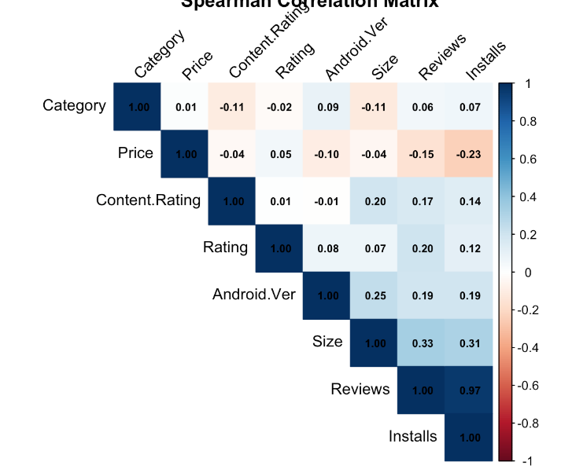

```{r setup, include=FALSE}
knitr::opts_chunk$set(warning = F, results = "markdown", message = F)
```

# Introduction

In the rapidly evolving smartphone landscape, Android has emerged as the dominant mobile operating system, now powering over 2.5 billion active devices worldwide. This extensive user base encompasses nearly 90% of smartphone users engaged with Android devices. A key aspect of this experience is the Google Play Store, which offers a diverse range of applications that simplify various aspects of daily life, from productivity to entertainment.

There were several factors which drove the decision to analyze the Google Play Store dataset. First, it provides free, real-time data that allows developers and researchers to assess user interactions without financial barriers, making it an invaluable resource for uncovering trends in user engagement. Second, the dataset includes important app metrics, such as category, rating, and reviews, enabling deeper exploration of user behavior and preferences.

Understanding these preferences is crucial for developers aiming to create successful applications. Each interaction within the Play Store offers critical insights into the factors that significantly influence app popularity. This analysis will identify trends in the dataset to enhance understanding of users. By examining variables such as app category, update frequency, Android version compatibility, content ratings, and the impact of positive reviews and ratings, we can delineate the elements that drive app installations and overall popularity. The nuanced relationships among these data points are essential for developers seeking to create applications that resonate with users. By detecting patterns through this analysis, we can provide valuable insights to developers, equipping them with the information needed to craft better apps tailored to user expectations and preferences. This research aims to deepen our understanding of user dynamics in an ever-evolving app ecosystem, which is critical for fostering user engagement and satisfaction.


# Research Context and Literature Review


During the investigation of user interactions with mobile applications, a range of methodologies was explored to gain an expert perspective. It was discovered that numerous studies have been conducted to provide insights into how users engage with apps on platforms such as the Google Play Store.  Initially, a comprehensive review of existing literature was conducted to understand the dynamics of user behavior and app engagement. Notably, the study titled "User Experience and Interaction in Mobile Applications" was analyzed, which highlighted the importance of user-centric design. This research illustrated that positive user experiences significantly contribute to app success and retention rates, suggesting that developers should prioritize understanding user needs and preferences.


Expert analyses from various sources further supported the findings, indicating that emotional responses play a crucial role in user satisfaction. Overall, the conducted research underscores the nuanced relationships between user interactions and app design, suggesting that a deeper understanding of these dynamics can lead to the development of more effective and engaging applications.

---

# Data Description


The dataset we have taken is a popular Google Play Store apps dataset from Kaggle, containing details about apps available on the platform. It has 10,841 observations (rows) and 13 variables (columns), with information about each app's attributes, ratings, and more. Here’s a breakdown of each column in the dataset:

App: The name of the app.
Category: The app category (e.g., ART_AND_DESIGN, BUSINESS).
Rating: The user rating of the app on a scale from 1 to 5 (float).
Reviews: The number of user reviews for the app, stored as text and needs conversion to numeric for analysis.
Size: The app size (e.g., "19M", "14M", "Varies with device"), which may need cleaning to standardize for analysis.
Installs: The number of installs as a text field (e.g., "10,000+", "1,000,000+"), requiring conversion to numeric.
Type: Whether the app is "Free" or "Paid".
Price: The app’s price (in USD), with free apps listed as "0" and paid apps with the price value in text format.
Content Rating: The age rating of the app (e.g., "Everyone", "Teen").
Genres: The genre(s) of the app, sometimes containing multiple genres separated by semicolons.
Last Updated: The date when the app was last updated, stored as text and can be converted to a date format.
Current Ver: The current version of the app, stored as text and might have different formats.
Android Ver: The minimum Android version required to run the app, given as text (e.g., "4.0.3 and up").

Here's a visualization of our dataset structure:

---

# Data Limitations
The Google Play Store dataset we choose provides valuable insights into app performance and user reviews, but including few features might help us analyse the depth and accuracy of  our analysis. 

Features like user engagement metrics, for example how often the user engage with the app after installation or if he deletes the app later, sessionlength etc would let us understand deeper and help differentiate between one-time installs and regular users. 

The dataset has several missing values, particularly in the Rating column, which necessitates careful handling to avoid introducing bias into the analysis. Additionally, there is no demographic information about users, such as age, location, or device type, which restricts our ability to segment user groups or understand how various demographics interact with different app categories.

An additional aspect of the data that could have been included is the reviews, which would have been valuable for assessing whether the feedback is positive or negative. This information would provide further insights into whether a higher number of reviews correlates with a positive reception.

Further, the inclusion of data on marketing efforts, like ad spend or whether an app was featured on the Play Store, could clarify the impact of promotion on installs and ratings. 


#### Missing records in our Data


---

# Exploratory Data Analysis (EDA)

### Data exploring

The dataset has several missing values, particularly in the Rating column, which necessitates careful handling to avoid introducing bias into the analysis. Additionally, there is no demographic information about users, such as age, location, or device type, which restricts our ability to segment user groups or understand how various demographics interact with different app categories.

### Data Cleaning

The Google Play Store dataset, as analyzed, contains missing values and inconsistent formats across various columns. To clean and prepare this dataset for analysis, several steps were taken to address these data quality issues. Here is an overview of how missing records were managed and further improvements that could be considered:

* Duplicates in App Names: Initially, there were 404 duplicated apps that appeared twice or even thrice. By removing these duplicates, the dataset was reduced from 10,841 to 9,660 unique apps. This ensures that only one instance of each app is considered, eliminating redundancy and potential skew in subsequent analysis.
Total duplicates removed: 1,181 apps.

* Price Column: The Price column contained dollar symbols ($) that had to be removed for conversion to numeric format. After cleaning, missing values were identified in the Price column. These missing values were handled by removing rows where Price was NA or blank.
Rows with missing or blank prices were dropped, as they were not relevant for assessing price impact on app installs.

* Type Column: The Type column had one missing value, where the Type was NA. Since the Price was recorded as 0 for this app, it was assumed to be a "Free" app. This missing value was replaced with "Free" to maintain data consistency. This replacement decision was made based on logical inference, ensuring the data accurately reflects app types without dropping valuable records.

* Size Column: The Size column had a mix of values in kilobytes (KB) and megabytes (MB), as well as entries labeled "Varies with device." The latter were treated as NA and replaced with the mean size for each category. Apps with sizes marked as "Varies with device" or having missing sizes were assigned the average size of other apps in the same category. This approach allowed retention of records while maintaining reasonable size estimates.

* Installs Column: The Installs column contained entries with symbols like + and commas, which were removed to convert the data into a numeric format. Some records had non-numeric entries or unusual characters, so these were cleaned systematically. A custom function was used to remove these symbols, ensuring all install counts were represented as clean, comparable integers.

* Rating and Reviews Columns: The Rating column contained 1,463 missing values, predominantly in the "Family" category. Rather than dropping these records, the missing values were replaced with the mean rating of apps within the same category. This imputation method helped maintain category-wise data integrity. The Reviews column, initially in string format, was converted to integer format after addressing missing values. Converting to numeric allowed for statistical analysis, such as calculating averages or correlations with installs or ratings.

* Last Updated: The date format in the "Last Updated" column was adjusted to an appropriate format to ensure accurate analysis.

* Current Version: The current version of the app is unique to each application, making it unsuitable as a comparative metric across different apps. Additionally, the versio format varies from one application to another, leading to dropping the column.

Additional Transformations done for effective analysis:

* Review Category
The review category was binned to ensure that each category contained an approximately equal number of reviews. This approach enhances the validity of the comparisons, as it prevents any one category from dominating the analysis due to an excessive number of reviews. Binning allows for a more balanced representation of different review sentiments across categories, facilitating a clearer understanding of how reviews impact app success.

* Install Category
The install category was created based on the distribution of installs present in the dataset. By analyzing the install figures, the data was binned into meaningful segments, ensuring that each segment reflects a realistic range of installs. This method allows for a comparative analysis of how different levels of installs correlate with other variables, such as ratings and review categories.

* Log Transformed Installs
Log transformation of installs was utilized to normalize the data, making it easier to compare and analyze the installations across various categories. This transformation is particularly useful in addressing the skewness commonly present in raw install data, enabling a more straightforward comparison of distributions. By applying the log transformation, we can better visualize relationships and draw more reliable conclusions regarding app success metrics.

* Update Category
The update category distinguishes between "Old Update" and "Recent Update," based on the update time recorded in the dataset. This categorization allows for the assessment of how recent updates may affect user perceptions and app performance. By classifying apps into these two groups, we can investigate the potential impact of frequent updates on installs and overall app ratings.


### Data Visualization


To illustrate the relationships between the variables, we employed various visualization methods, including bar plots, scatter plots, heat maps, and other techniques. The selection of these visualization methods was based on the types of variables being plotted and their relevance to our analysis. This approach aimed to identify which applications exhibit the highest popularity by examining the relationships among reviews, ratings, and installs. If a positive relationship is evident among these metrics, we can concentrate on the relationship with installs, as it ultimately reflects the user base for an application.

The visualizations we have chosen include:

1. Installs and Price
2. Ratings and Days since last update
3. Installs and Update Category and Content Rating
4. Installs and size
5. Installs and Rating
6. Ratings and Review Category
7. Installs and Review Category
8. Top 5 Categories with Highest Installs

These visualizations are designed to provide insights into the factors influencing app success on the Google Play Store.
8





### Notable Observations


1. Fig 1 reveals that the majority of app installs are concentrated in free apps, with a notable decline as app prices increase. This illustrates a strong inverse relationship between price and installs, emphasizing consumer preference for free options over paid ones in the app market.

2. In Fig 2, it can be observed that as the number of days since the last update increase, app ratings tend to decline. This trend showcases the critical role of regular updates in maintaining user satisfaction and app quality.

3. Fig 3 reveals a notable difference in installs between apps with recent and old updates. Apps with recent updates tend to have higher install rates compared to those with older updates. Additionally, apps rated for "Everyone 10+" have the highest number of installs among the different content ratings.

4. In Fig 4, there is no strong, linear relationship between app size and install count. The data points are scattered across the plot, indicating that app size does not necessarily determine the number of installs.

5. Fig 5 suggests a slight positive correlation between app rating and install count. Apps with higher ratings tend to have higher install numbers, especially in the higher rating ranges. However, the relationship is not perfectly linear, and other factors likely influence install counts.

6. Fig 6 indicates a positive correlation between review count and rating. This suggests that apps with a higher number of reviews tend to have higher ratings. This trend implies that a larger number of reviews can positively influence an app's overall rating.

7. Fig 7 reveals a positive correlation between review category and install count. Apps with higher review categories, likely indicating a larger number of positive reviews, tend to have higher install numbers. This finding reinforces the trend observed in Figure 6, where higher ratings are associated with higher installs.

8. In Fig 8, it is evident that the top five categories with the highest number of installs are Entertainment, Photography, Video, Communication, and Social. This suggests that applications like WhatsApp and Messenger rank among the most installed, aligning with their daily use by many users. The popularity of these categories reflects a trend where apps enhancing social interaction and visual expression dominate user preferences, contributing to high engagement rates.


9. In Fig 9, several key correlations can be observed:

Strong Correlation
(i). **Installs and Reviews**: 
   - A very strong positive correlation of **0.95** indicates that apps with more installs tend to receive more reviews. This suggests that popular apps attract significant user feedback.

Moderate Correlation
(ii). **Price and Installs**: 
   - A negative correlation of **-0.23** suggests that higher-priced apps generally have fewer installs compared to free apps.
(iii). **Size and Installs**: 
   - A positive correlation of **0.31** indicates that larger apps tend to have higher installs, although this may also reflect specific categories that have larger app sizes.
(iv). **Days Since Last Update and Installs**: 
   - A negative correlation of **-0.33** implies that older updates are associated with fewer installs, highlighting the importance of regular updates in attracting users.

Slight Correlation
(v). **Reviews and Ratings**: 
   - There is a slight correlation suggesting that higher ratings are associated with more reviews, indicating that positive feedback may lead to increased user engagement.
(vi). **Android Version and Installs**: 
   - Compatibility with more Android versions is positively correlated with higher installs, suggesting that broader compatibility may enhance an app’s reach.
  
These observations underscore significant relationships between app characteristics and user engagement metrics, offering valuable insights for developers and marketers.While the relationships between installs, reviews, and ratings provide valuable insights, it suggests that focusing solely on install counts could suffice for assessing an app's popularity. This perspective emphasizes the significance of installs as a primary metric, potentially simplifying the evaluation process for developers and marketers.


# SMART Question
“What is the impact of content rating, required Android version, app category, size, and pricing on predicting app success in terms of positive ratings and high user reviews, as well as the number of installs, using data from Google Play Store apps from 2010 to 2018?”

### SMART Analysis
The proposed research question investigates how various factors—such as content rating, required Android version, app category, size, and pricing—affect the success of applications on the Google Play Store, specifically in terms of positive ratings, high user reviews, and download numbers. By analyzing data from 2010 to 2018, this study aims to identify patterns and correlations that could provide insights into what drives user engagement and satisfaction. Understanding these relationships will be critical for developers seeking to enhance app performance and appeal in a competitive market.

Our research aims to answer the following questions:
1. Does price significantly impact the popularity of an app in terms of installs?
2. Does Reviews  and Ratings have significantly impact the popularity of an app in terms of installs?
3. Does Update have significant impact on Rating?
4. Does Content Rating and Last Updated  significantly impact the popularity of an app in terms of installs?
5. Does app size have significant impact on the number of Installs ?


# Probing Smart Qestion: Hypothesis Testing Approach

* *Question 1:* Does price significantly impact the popularity of an app in terms of installs?

*Null Hypothesis(H₀):*
*Alternate Hypothesis(H₁):*
*Test:*
*Observation:*
*Conclusion:*

* *Question 2:* Does Reviews  and Ratings have significantly impact the popularity of an app in terms of installs?

*Null Hypothesis(H₀):*
*Alternate Hypothesis(H₁):*
*Test:*
*Observation:*
*Conclusion:*

* *Question 3:* Does Update have significant impact on Rating?

*Null Hypothesis(H₀):*
*Alternate Hypothesis(H₁):*
*Test:*
*Observation:*
*Conclusion:*

* *Question 4:* Does Content Rating and Last Updated  significantly impact the popularity of an app in terms of installs?

*Null Hypothesis(H₀):*
*Alternate Hypothesis(H₁):*
*Test:*
*Observation:*
*Conclusion:*

* *Question 5:* Does app size have significant impact on the number of Installs ?

*Null Hypothesis(H₀):*
*Alternate Hypothesis(H₁):*
*Test:*
*Observation:*
*Conclusion:*

