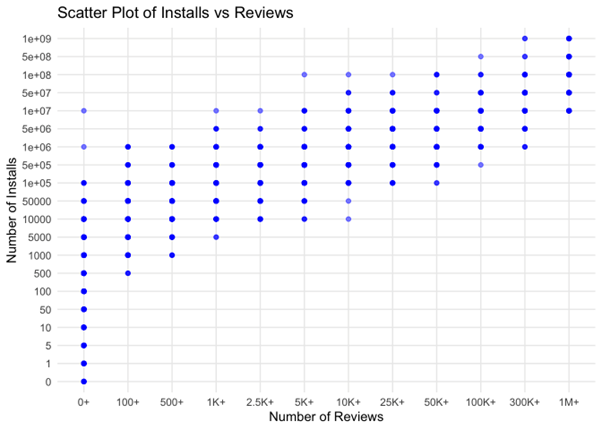

```{r setup, include=FALSE}
knitr::opts_chunk$set(warning = F, results = "markdown", message = F)
```

# **Introduction**

In the rapidly evolving smartphone landscape, Android has emerged as the
dominant mobile operating system, now powering over 2.5 billion active
devices worldwide (Brandom, 2019). This extensive user base encompasses
nearly 90% of smartphone users engaged with Android devices. A key
aspect of this experience is the Google Play Store, which offers a
diverse range of applications that simplify various aspects of daily
life, from productivity to entertainment.

There were several factors which drove the decision to analyze the
Google Play Store dataset. First, it provides free, real-time data that
allows developers and researchers to assess user interactions without
financial barriers, making it an invaluable resource for uncovering
trends in user engagement. Second, the dataset includes important app
metrics, such as category, rating, and reviews, enabling deeper
exploration of user behavior and preferences.

Understanding these preferences is crucial for developers aiming to
create successful applications. Each interaction within the Play Store
offers critical insights into the factors that significantly influence
app popularity. This analysis will identify trends in the dataset to
enhance understanding of users. By examining variables such as app
category, update frequency, Android version compatibility, content
ratings, and the impact of positive reviews and ratings, we can
delineate the elements that drive app installations and overall
popularity. The nuanced relationships among these data points are
essential for developers seeking to create applications that resonate
with users. By detecting patterns through this analysis, we can provide
valuable insights to developers, equipping them with the information
needed to craft better apps tailored to user expectations and
preferences. This research aims to deepen our understanding of user
dynamics in an ever-evolving app ecosystem, which is critical for
fostering user engagement and satisfaction.

# **Literature Review**

During the investigation of user interactions with mobile applications,
a range of methodologies was explored to gain an expert perspective. It
was discovered that numerous studies have been conducted to provide
insights into how users engage with apps on platforms such as the Google
Play Store.  Initially, a comprehensive review of existing literature
was conducted to understand the dynamics of user behavior and app
engagement. Notably, the study "Building a Quality Mobile Application: A
User-Centered Study Focusing on Design Thinking, User Experience and
Usability" was analyzed, highlighting the importance of user-centric
design (Paula et al., 1970). This research illustrated that positive
user experiences significantly contribute to app success and retention
rates, suggesting that developers should prioritize understanding user
needs and preferences.

Expert analyses from various sources further supported the findings,
indicating that emotional responses play a crucial role in user
satisfaction. Overall, the conducted research underscores the nuanced
relationships between user interactions and app design, suggesting that
a deeper understanding of these dynamics can lead to the development of
more effective and engaging applications.

------------------------------------------------------------------------

# **Data Description**

The dataset used in this study is a popular collection of Google Play
Store apps, sourced from Kaggle (faisaljanjua0555, 2023). It contains
detailed information about 10,841 apps, organized across 13 variables,
with each row representing an individual app. The dataset covers a range
of app attributes, such as ratings, reviews, size, category, installs,
price, and content rating, providing valuable insights into the
characteristics that contribute to app popularity and user engagement.
This comprehensive data serves as a foundation for analyzing patterns in
user behavior, app performance, and trends within the mobile app
ecosystem. Below is a breakdown of each column in the Google Play Store
apps dataset:

| Variable | Description |
|--------------------|----------------------------------------------------|
| App | The name of the app. |
| Category | The app category (e.g., ART_AND_DESIGN, BUSINESS). |
| Rating | The user rating of the app on a scale from 1 to 5 (float). |
| Reviews | The number of user reviews for the app, stored as text and needs conversion to numeric for analysis. |
| Size | The app size (e.g., “19M”, “14M”, “Varies with device”), which may need cleaning to standardize for analysis. |
| Installs | The number of installs as a text field (e.g., “10,000+”, “1,000,000+”), requiring conversion to numeric. |
| Type | Whether the app is “Free” or “Paid”. |
| Price | The app’s price (in USD), with free apps listed as “0” and paid apps with the price value in text format. |
| Content Rating | The age rating of the app (e.g., “Everyone”, “Teen”). |
| Genres | The genre(s) of the app, sometimes containing multiple genres separated by semicolons. |
| Last Updated | The date when the app was last updated, stored as text and can be converted to a date format. |
| Current Ver | The current version of the app, stored as text and might have different formats. |
| Android Ver | The minimum Android version required to run the app, given as text (e.g., “4.0.3 and up”). |

Here's a visualization of our dataset structure:  ---

# **Data Limitations**

The Google Play Store dataset we choose provides valuable insights into
app performance and user reviews, but including few features might help
us analyse the depth and accuracy of our analysis.

Features like user engagement metrics, for example how often the user
engage with the app after installation or if he deletes the app later,
sessionlength etc would let us understand deeper and help differentiate
between one-time installs and regular users.

An additional aspect of the data that could have been included is the
reviews, which would have been valuable for assessing whether the
feedback is positive or negative. This information would provide further
insights into whether a higher number of reviews correlates with a
positive reception.

Further, the inclusion of data on marketing efforts, like ad spend or
whether an app was featured on the Play Store, could clarify the impact
of promotion on installs and ratings.

#### Missing records in our Data

The dataset has several missing values, particularly in the Rating
column, which necessitates careful handling to avoid introducing bias
into the analysis. Additionally, the absence of demographic information
about users, such as age, location, or device type restricts our ability
to segment user groups or understand how various demographics interact
with different app categories (Fischer, & Kleen 2021).
------------------------------------------------------------------------

# **Exploratory Data Analysis (EDA)**

### Data Exploring

The dataset has several missing values, particularly in the Rating
column, which necessitates careful handling to avoid introducing bias
into the analysis. Additionally, there is no demographic information
about users, such as age, location, or device type, which restricts our
ability to segment user groups or understand how various demographics
interact with different app categories.

### Data Cleaning

The Google Play Store dataset, as analyzed, contains missing values and
inconsistent formats across various columns. To clean and prepare this
dataset for analysis, several steps were taken to address these data
quality issues. Here is an overview of how missing records were managed
and further improvements that could be considered:

-   Duplicates in App Names: Initially, there were 404 duplicated apps
    that appeared twice or even thrice. By removing these duplicates,
    the dataset was reduced from 10,841 to 9,660 unique apps. This
    ensures that only one instance of each app is considered,
    eliminating redundancy and potential skew in subsequent analysis.
    Total duplicates removed: 1,181 apps.

-   Price Column: The Price column contained dollar symbols (\$) that
    had to be removed for conversion to numeric format. After cleaning,
    missing values were identified in the Price column. These missing
    values were handled by removing rows where Price was NA or blank.
    Rows with missing or blank prices were dropped, as they were not
    relevant for assessing price impact on app installs.

-   Type Column: The Type column had one missing value, where the Type
    was NA. Since the Price was recorded as 0 for this app, it was
    assumed to be a "Free" app. This missing value was replaced with
    "Free" to maintain data consistency. This replacement decision was
    made based on logical inference, ensuring the data accurately
    reflects app types without dropping valuable records.

-   Size Column: The Size column had a mix of values in kilobytes (KB)
    and megabytes (MB), as well as entries labeled "Varies with device."
    The latter were treated as NA and replaced with the mean size for
    each category. Apps with sizes marked as "Varies with device" or
    having missing sizes were assigned the average size of other apps in
    the same category. This approach allowed retention of records while
    maintaining reasonable size estimates.

-   Installs Column: The Installs column contained entries with symbols
    like + and commas, which were removed to convert the data into a
    numeric format. Some records had non-numeric entries or unusual
    characters, so these were cleaned systematically. A custom function
    was used to remove these symbols, ensuring all install counts were
    represented as clean, comparable integers.

-   Rating and Reviews Columns: The Rating column contained 1,463
    missing values, predominantly in the "Family" category. Rather than
    dropping these records, the missing values were replaced with the
    mean rating of apps within the same category. This imputation method
    helped maintain category-wise data integrity. The Reviews column,
    initially in string format, was converted to integer format after
    addressing missing values. Converting to numeric allowed for
    statistical analysis, such as calculating averages or correlations
    with installs or ratings.

-   Last Updated: The date format in the "Last Updated" column was
    adjusted to an appropriate format to ensure accurate analysis.

-   Category and Genres: The dataset consists of 33 unique values for
    Category and 118 for Genres, meaning multiple genres fall under each
    category. Since genres are already embedded within categories,
    retaining both columns could introduce redundancy and complicate the
    analysis. This simplifies the dataset while preserving the essential
    structure needed for meaningful insights.

-   Current Version:  The format of the "Current Version" values for
    apps varies among developers, making it difficult to achieve
    consistency across the dataset. Due to this variability, it has been
    determined that this variable will be excluded from the analysis. By
    removing the "Current Version" column, the dataset can maintain
    clarity and focus on more consistent and relevant attributes that
    contribute to app success.

-   Android Version: Although there are no missing values for the
    "Android Version" variable, two rows contain 'NaN' entries, which
    have been removed from the dataset.

Additional Transformations done for effective analysis:

-   Review Category The review category was binned to ensure that each
    category contained an approximately equal number of reviews. This
    approach enhances the validity of the comparisons, as it prevents
    any one category from dominating the analysis due to an excessive
    number of reviews. Binning allows for a more balanced representation
    of different review sentiments across categories, facilitating a
    clearer understanding of how reviews impact app success.

-   Install Category The install category was created based on the
    distribution of installs present in the dataset. By analyzing the
    install figures, the data was binned into meaningful segments,
    ensuring that each segment reflects a realistic range of installs.
    This method allows for a comparative analysis of how different
    levels of installs correlate with other variables, such as ratings
    and review categories.

-   Log Transformed Installs Log transformation of installs was utilized
    to normalize the data, making it easier to compare and analyze the
    installations across various categories. This transformation is
    particularly useful in addressing the skewness commonly present in
    raw install data, enabling a more straightforward comparison of
    distributions. By applying the log transformation, we can better
    visualize relationships and draw more reliable conclusions regarding
    app success metrics.

-   Update Category The update category distinguishes between "Old
    Update" and "Recent Update," based on the update time recorded in
    the dataset. This categorization allows for the assessment of how
    recent updates may affect user perceptions and app performance. By
    classifying apps into these two groups, we can investigate the
    potential impact of frequent updates on installs and overall app
    ratings.

### Data Visualization

To illustrate the relationships between the variables, we employed
various visualization methods, including bar plots, scatter plots, heat
maps, and other techniques. The selection of these visualization methods
was based on the types of variables being plotted and their relevance to
our analysis. This approach aimed to identify which applications exhibit
the highest popularity by examining the relationships among reviews,
ratings, and installs. If a positive relationship is evident among these
metrics, we can concentrate on the relationship with installs, as it
ultimately reflects the user base for an application.

The visualizations we have chosen include:

1.  Installs and Price
2.  Ratings and Days since last update
3.  Installs and Update Category and Content Rating
4.  Installs and size
5.  Installs and Rating
6.  Ratings and Review Category
7.  Installs and Review Category
8.  Top 5 Categories with Highest Installs

These visualizations are designed to provide insights into the factors
influencing app success on the Google Play Store.

::: {style="text-align: center;"}
**Figure 1**. Scatterplot for Price and Installs
:::

{style="display: block; margin: 0 auto;"}

Figure 1 reveals that the majority of app installs are concentrated in
free apps, with a notable decline as app prices increase. This
illustrates a strong inverse relationship between price and installs,
emphasizing consumer preference for free options over paid ones in the
app market.

::: {style="text-align: center;"}
**Figure 2**. Scatterplot for Correlation Between Days Since Last Update
and Rating
:::

{style="display: block; margin: 0 auto;"}

In Figure 2, it can be observed that as the number of days since the
last update increase, app ratings tend to decline. This trend showcases
the critical role of regular updates in maintaining user satisfaction
and app quality.

::: {style="text-align: center;"}
**Figure 3**. Boxplot for Installs vs. Update Category for Each Content
Rating
:::

{style="display: block; margin: 0 auto;"}

Figure 3 reveals a notable difference in installs between apps with
recent and old updates. Apps with recent updates tend to have higher
install rates compared to those with older updates. Additionally, apps
rated for "Everyone 10+" have the highest number of installs among the
different content ratings.

::: {style="text-align: center;"}
**Figure 4**. Plot for Installs vs. Size
:::

{style="display: block; margin: 0 auto;"}

In Figure 4, there is no strong, linear relationship between app size
and install count. The data points are scattered across the plot,
indicating that app size does not necessarily determine the number of
installs.

::: {style="text-align: center;"}
**Figure 5**. Plot for Installs vs. Rating
:::

{style="display: block; margin: 0 auto;"}

Figure 5 suggests a slight positive correlation between app rating and
install count. Apps with higher ratings tend to have higher install
numbers, especially in the higher rating ranges. However, the
relationship is not perfectly linear, and other factors likely influence
install counts.

::: {style="text-align: center;"}
**Figure 6**. Plot for Mean Rating by Review Category
:::

{style="display: block; margin: 0 auto;"}

Figure 6 indicates a positive correlation between review count and
rating. This suggests that apps with a higher number of reviews tend to
have higher ratings. This trend implies that a larger number of reviews
can positively influence an app's overall rating.

::: {style="text-align: center;"}
**Figure 7**. Scatterplot for Installs vs. Reviews
:::

{style="display: block; margin: 0 auto;"}

Figure 7 reveals a positive correlation between review category and
install count. Apps with higher review categories, likely indicating a
larger number of positive reviews, tend to have higher install numbers.
This finding reinforces the trend observed in Figure 6, where higher
ratings are associated with higher installs.

::: {style="text-align: center;"}
**Figure 8**. Boxplot for Top 5 Category with Most Installs
:::

{style="display: block; margin: 0 auto;"}

In Figure 8, it is evident that the top five categories with the highest
number of installs are Entertainment, Photography, Video, Communication,
and Social. This suggests that applications like WhatsApp and Messenger
rank among the most installed, aligning with their daily use by many
users. The popularity of these categories reflects a trend where apps
enhancing social interaction and visual expression dominate user
preferences, contributing to high engagement rates.

::: {style="text-align: center;"}
**Figure 9**. Heatmap for Correlations Between the Variables
:::

{style="display: block; margin: 0 auto;"}

In Figure 9, several key correlations can be observed:

Strong Correlation (i). **Installs and Reviews**: - A very strong
positive correlation of **0.95** indicates that apps with more installs
tend to receive more reviews. This suggests that popular apps attract
significant user feedback.

Moderate Correlation (ii). **Price and Installs**: - A negative
correlation of **-0.23** suggests that higher-priced apps generally have
fewer installs compared to free apps. (iii). **Size and Installs**: - A
positive correlation of **0.31** indicates that larger apps tend to have
higher installs, although this may also reflect specific categories that
have larger app sizes. (iv). **Days Since Last Update and Installs**: -
A negative correlation of **-0.33** implies that older updates are
associated with fewer installs, highlighting the importance of regular
updates in attracting users.

Slight Correlation (v). **Reviews and Ratings**: - There is a slight
correlation suggesting that higher ratings are associated with more
reviews, indicating that positive feedback may lead to increased user
engagement. (vi). **Android Version and Installs**: - Compatibility with
more Android versions is positively correlated with higher installs,
suggesting that broader compatibility may enhance an app’s reach.

These observations underscore significant relationships between app
characteristics and user engagement metrics, offering valuable insights
for developers and marketers.While the relationships between installs,
reviews, and ratings provide valuable insights, it suggests that
focusing solely on install counts could suffice for assessing an app's
popularity. This perspective emphasizes the significance of installs as
a primary metric, potentially simplifying the evaluation process for
developers and marketers.

# **SMART Question**

“What is the impact of content rating, required Android version, app
category, size, and pricing on predicting app success in terms of
positive ratings and high user reviews, as well as the number of
installs, using data from Google Play Store apps from 2010 to 2018?”

### SMART Analysis

The proposed research question investigates how various factors—such as
content rating, required Android version, app category, size, and
pricing—affect the success of applications on the Google Play Store,
specifically in terms of positive ratings, high user reviews, and
download numbers. By analyzing data from 2010 to 2018, this study aims
to identify patterns and correlations that could provide insights into
what drives user engagement and satisfaction. Understanding these
relationships will be critical for developers seeking to enhance app
performance and appeal in a competitive market.

### Probing Smart Questions: Hypothesis Testing Approach
Our research aims to answer the following questions: 

***Question 1: Does price significantly impact the popularity of an
    app in terms of installs?***

- **Null Hypothesis (H₀):** There is no significant difference in the mean log installs between   free and paid apps. (Price does not impact app popularity.)

- **Alternate Hypothesis (H₁):** There is a significant difference in the mean log installs     between free and paid apps. (Price impacts app popularity.)

- **Test:**  Independent t-test
<br>t-value: 29.042
<br>Degrees of Freedom (df): 977.19
<br>P-value: < 2.2e-16

- **Observation:**
<br>The p-value is extremely small (less than 0.05), which indicates strong evidence against the     null hypothesis.
<br>The mean log installs for free apps (11.002709) is significantly higher than for paid apps    (7.284829).

- **Conclusion:**
Since the p-value is very small, we reject the null hypothesis and conclude that the difference   in mean log installs between free and paid apps is statistically significant. This suggests       that price does indeed have a significant impact on app popularity in terms of installs.


***Question 2: Does Reviews and Ratings have significantly impact the popularity of an app in terms of installs?***

- **Null Hypothesis (H₀):** There is no significant difference in the mean rating across different review categories. (Review count does not impact app rating.)

- **Alternate Hypothesis (H₁):** There is a significant difference in the mean rating across different review categories. (Review count impacts app rating.)

- **Test:** ANOVA
<br>F Value (f): 41.3
<br>Degrees of Freedom (df): 11
<br>P-value: < 2e-16

- **Observation:**
The p-value is extremely small (less than 0.05), indicating strong evidence against the null hypothesis.
The mean rating generally increases with higher review categories, from 4.03 in the "100+" category to 4.43 in the "1M+" category.

- **Conclusion:**
Since the p-value is very small, we reject the null hypothesis. This suggests that the number of reviews does have a statistically significant impact on the mean rating. Higher-rated apps, particularly those with many reviews, are likely more popular, indicating that review count and rating significantly impact app popularity in terms of installs.


***Question 3: Does Update have significant impact on Rating?***

- **Null Hypothesis (H₀):**The number of days since the last update does not significantly impact the app rating.
- **Alternate Hypothesis (H₁):** The number of days since the last update does significantly impact the app rating.

- **Test:** ANOVA (Analysis of Variance)
<br>F-value: 143.8
<br>P-value: < 2e-16

- **Observation:**
The p-value is extremely small (less than 0.05), indicating strong evidence against the null hypothesis.
A high F-value (143.8) further supports that there is a significant difference in app ratings based on the time since the last update.

- **Conclusion:**
Since the p-value is very small, we reject the null hypothesis and conclude that the time since the last update has a statistically significant impact on app ratings.


***Question 4: Does Content Rating and Last Updated significantly impact the popularity of an app in terms of installs?***

- **Null Hypothesis (H₀):** There is no significant difference in the mean log installs between apps with different content ratings. (Content Rating does not impact app popularity.)

- **Alternate Hypothesis (H₁):** There is a significant difference in the mean log installs between apps with different content ratings. (Content Rating impacts app popularity.)

- **Test:** ANOVA
<br>F-Value: 41.95
<br>Degrees of Freedom (df): 5, 9638
<br>P-value: < 2e-16

- **Observation:**
The p-value is extremely small (less than 0.05), indicating strong evidence against the null hypothesis.The ANOVA results suggest a significant difference in installs between content ratings, implying that content rating categories have an impact on the number of installs.

- **Conclusion:**
Since the p-value is very small, we reject the null hypothesis and conclude that the difference in installs between content ratings is statistically significant. This suggests that content rating does indeed have a significant impact on app popularity in terms of installs.

***Question 5: Does app size have significant impact on the number of Installs ?***

- **Null Hypothesis (H₀):** There is no significant correlation between app size and the number of installs. (App size does not impact the number of installs.)

- **Alternate Hypothesis (H₁):** There is a significant correlation between app size and the number of installs. (App size impacts the number of installs.)
Test:

- **Test**: Correlation t-test
<br>t-value: 4.0069
<br>Degrees of Freedom (df): 9657
<br>P-value: 6.198e-05
<br>Correlation Coefficient: 0.0407
<br>95% Confidence Interval: 0.0208 to 0.0606

- **Observation:**
The p-value is very small (less than 0.05), indicating strong evidence against the null hypothesis.However, the correlation coefficient (0.0407) is close to zero, suggesting a weak positive correlation between app size and the number of installs.

- **Conclusion:**
Since the p-value is very small, we reject the null hypothesis, concluding that there is a statistically significant but weak positive correlation between app size and the number of installs. This suggests that app size has a minor impact on the number of installs.

# **Conclusion**
Expanding on the insights drawn from the analysis of Google Play Store applications, this study dives deep into the intricate factors that influence an app's success, particularly concerning the number of installations and user ratings. The Google Play Store, as a massive platform hosting millions of applications across various categories, provides a unique landscape to explore how specific attributes correlate with app popularity and user engagement. This comprehensive conclusion will not only reflect the observed patterns and associations among variables such as content rating, app size, update frequency, and pricing but also emphasize the broader implications of these findings on app development, user engagement, and market strategy.

**1. Content Rating as a Key Indicator of User Trust and Accessibility**

One of the most significant findings in this study is the strong influence of content rating on app installations and user ratings. Content rating serves as a proxy for the target audience's age group, indicating whether an app is suitable for all ages or is intended for a specific demographic, such as teenagers or adults. Apps rated for general audiences often tend to have higher installation rates, largely due to their broader accessibility. On the other hand, apps with mature content or restricted ratings may appeal to a narrower, more specific audience.

The impact of content rating can be understood through user psychology and trust. Users tend to favor applications that are considered safe and suitable for their age group or for a wider range of age groups, leading to higher installation rates for apps with general ratings. Developers who understand this correlation can leverage it to design applications that meet the needs of a diverse audience. For example, a gaming app with engaging, family-friendly content is likely to appeal to both children and adults, potentially increasing its reach and popularity. In contrast, apps targeted solely at adults might focus more on niche functionality, understanding that they may attract fewer installs but potentially more engaged users.

**2. The Role of Update Frequency in Sustaining User Engagement**

Another critical aspect that emerged from the analysis is the positive correlation between update frequency and app success, as seen through both installations and user ratings. Apps that are frequently updated tend to maintain a higher level of user engagement by addressing bugs, introducing new features, and aligning with the latest technological advancements. Users appreciate apps that evolve, as it shows that developers are invested in improving the user experience. Consequently, apps with regular updates often receive better ratings, as users recognize the developer's commitment to quality and enhancement.

The strategic significance of this insight lies in the maintenance and continuous improvement of apps. For instance, developers working on a utility app, like a calendar or weather app, may find that incorporating user feedback into regular updates improves user retention and satisfaction. Conversely, an app that remains stagnant is more likely to lose users to competitors who consistently innovate and respond to user demands. This finding suggests that app developers should adopt a proactive approach, utilizing user feedback to guide updates and optimize the app’s performance and features continually.

**3. App Size and Performance Trade-offs**

App size, while a statistically significant factor, exhibited a relatively weaker correlation with installations compared to other variables. The size of an app can influence its download rate, especially in regions where data limitations or lower-end devices with limited storage capacity are common. However, as mobile device storage capacities have increased, this factor may hold less weight in more developed regions or among users with high-end devices. Nevertheless, developers should be cautious about app size, particularly for users with restricted data plans or older devices.

From a strategic perspective, balancing functionality with size becomes crucial. An app overloaded with features may provide a comprehensive experience but may be less attractive if it requires substantial storage. For example, a photo-editing app might gain popularity if it offers high-quality features within a compact size. Developers can adopt techniques such as data compression, modular design, or cloud integration to reduce app size, making their apps accessible to a broader user base. This consideration reflects a growing need in the app market to create high-functioning but lightweight applications that cater to all user groups, regardless of their device specifications.

**4. Pricing Models and Consumer Preferences**

One of the most pronounced findings of this study is the preference for free applications, which enjoy higher installation rates than paid counterparts. The modern app marketplace reflects a significant consumer bias towards free apps, likely driven by the vast number of alternative options available at no cost. For developers, this insight has profound implications for app monetization strategies. While a paid model might initially seem advantageous for revenue generation, it could deter a large segment of potential users who are unwilling to pay upfront.

The preference for free apps suggests that developers may benefit from exploring alternative monetization strategies, such as in-app advertisements, freemium models, or in-app purchases. A freemium model, for instance, allows users to access the core functionalities of an app for free while offering additional premium features for a fee. This model has proven successful for many applications, as it provides a path for revenue generation without limiting user reach. An alternative is in-app advertising, where developers can generate income through advertisements displayed within the app. However, developers should be mindful of user experience, as overly intrusive ads may lead to negative ratings and decreased user retention. 

**5. Implications for App Developers and Market Strategies**

This study provides developers and marketers with actionable insights into optimizing app offerings for the Google Play Store, emphasizing the need for a user-centric approach in app design and strategy. By understanding the variables that contribute to app success, developers can make informed decisions on where to focus their resources and how to structure their product features. For instance, creating an app that is accessible to all audiences (as indicated by content rating), lightweight, frequently updated, and free to install could significantly enhance an app’s chances of success in the competitive app market.

Furthermore, this analysis highlights the importance of adopting a data-driven approach to app development. By analyzing patterns in user feedback and behaviors, developers can prioritize updates that address prevalent issues or add popular features, thus enhancing user satisfaction and increasing the likelihood of positive ratings and recommendations. Such a strategy is particularly vital in the current competitive landscape, where user loyalty is often contingent on seamless, reliable, and up-to-date experiences.

**6. Limitations and Future Research Directions**

While this analysis offers valuable insights, it is essential to acknowledge its limitations and suggest areas for future research. The study primarily focused on a subset of variables and did not account for other potential factors, such as app category, regional trends, or cultural preferences, which could influence user behavior. Future studies could expand on these findings by examining additional data sources or utilizing a larger dataset. Additionally, it would be beneficial to explore the causal relationships among variables, such as whether frequent updates directly cause higher ratings or if highly-rated apps are more likely to receive updates. Exploring these nuances could yield even more targeted insights for developers.

In conclusion, this study of Google Play Store applications underscores the importance of key factors like content rating, update frequency, app size, and pricing in determining app success. By aligning their strategies with these findings, developers can enhance their app's appeal, foster positive user engagement, and maintain competitive standing. As the app market continues to grow, staying informed of these trends will be crucial for developers seeking long-term success in an increasingly dynamic and competitive environment.

# **References**

Brandom, R. (2019, May 7). There are now 2.5 billion active Android
devices. The Verge.
<https://www.theverge.com/2019/5/7/18528297/google-io-2019-android-devices-play-store-total-number-statistic-keynote>

faisaljanjua0555. (2023a, May 20). eda - google play store apps. Kaggle.
<https://www.kaggle.com/code/faisaljanjua0555/eda-google-play-store-apps/input>

Fischer, F., & Kleen, S. (2021). Possibilities, Problems, and
Perspectives of Data Collection by Mobile Apps in Longitudinal
Epidemiological Studies: Scoping Review. Journal of medical Internet
research, 23(1), e17691. <https://doi.org/10.2196/17691>

Paula, D. F. O. de, Menezes, B. H. X. M., & Araújo, C. C. (1970, January
1). Building a quality mobile application: A user-centered study
focusing on design thinking, user experience and usability.
SpringerLink.
<https://link.springer.com/chapter/10.1007/978-3-319-07626-3_29#citeas>
